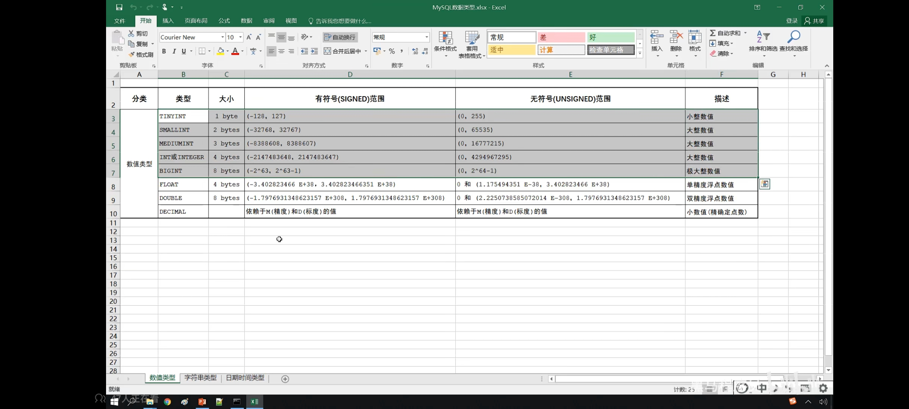
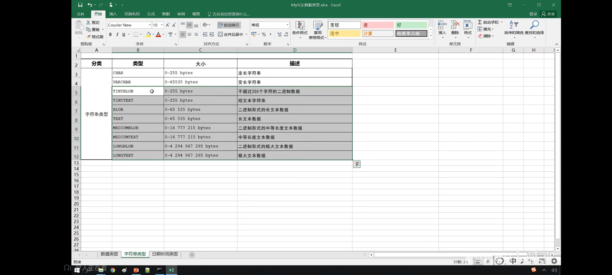
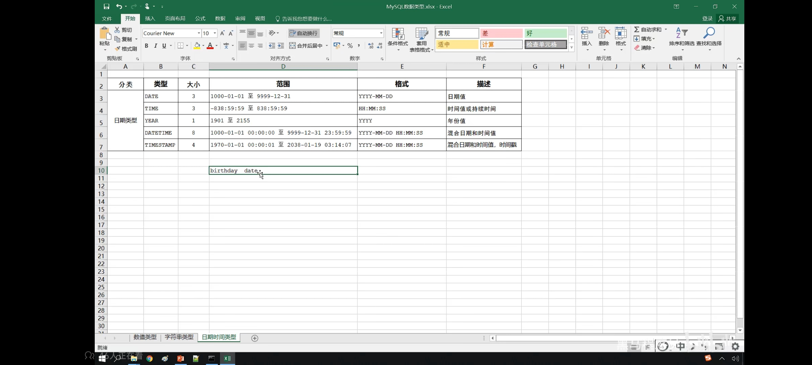

## MySQL 基础

- 概述
- SQL
- 函数
- 约束
- 多表查询
- 事务

### SQL

#### DDL（操作表结构，表中字段）

##### DDL 数据库操作

```SQL
-- 查询所有数据库
SHOW DATABASES;

-- 查询当前数据库
SELECT DATABASE();

-- 创建
CREATE DATABASE [IF NOT EXISTS] 数据库名 [DEFAULT CHARSET 字符集] [COLLATE 排序规则];

-- 删除
DROP DATABASE [IF EXISTS] 数据库名;

-- 使用
USE 数据库名;
```

##### DDL 表操作查询

```SQL
-- 查询当前数据库所有表
SHOW TABLES;

-- 查询表结构
DESC 表名;

-- 查询指定表的建表语句
SHOW CREATE TABLE 表名;
```

##### DDL 表操作创建

```SQL
CREATE 表名(
  字段1 字段1类型[COMMENT 字段1注释],
  字段2 字段2类型[COMMENT 字段2注释],
  ...
)[COMMENT 表注释]
```

##### DDL 表操作数据类型

-
-
-

##### DDL 表操作修改

```SQL
-- 添加字段
ALTER TABLE 表名 ADD 字段名 类型(长度) [COMMENT注释] [约束];

-- 修改字段类型
ALTER TABLE 表名 MODIFY 字段名 新数据类型(长度);

-- 修改字段名和字段类型
ALTER TABLE 表名 CHANGE 旧字段名 新字段名 类型(长度) [COMMENT注释] [约束];

-- 删除字段
ALTER TABLE 表名 DROP 字段名;

-- 修改表名
ALTER TABLE 表名 RENAME TO 新表名;
```

##### DDL 表操作删除

```SQL
-- 删除表
DROP TABLE [IF EXISTS] 表名;

-- 删除指定表，并重新创建该表
TRUNCATE TABLE 表名;
```

#### DML（数据增删改）

##### INSERT 添加数据

```SQL
-- 给指定字段添加数据
INSERT INTO 表名(字段名1，字段名2, ...) VALUES (值1, 值2, ...);

-- 给全部字段添加数据
INSERT INTO 表名 VALUES (值1, 值2, ...);

-- 批量添加数据
INSERT INTO 表名(字段名1，字段名2, ...) VALUES (值1, 值2, ...),(值1, 值2, ...),(值1, 值2, ...);
INSERT INTO 表名 VALUES (值1, 2值, ...),(值1, 值2, ...),(值1, 值2, ...);
```

注意：
1. 插入数据时，指定的字段顺序与值的顺序是一一对应的
2. 字符串和日期型数据应该包含在引号中
3. 插入的数据大小，应该在字段的规定范围内

##### UPDATE 修改数据

##### DELETE 删除数据

## MySQL 进阶

- 存储引擎
- 索引
- SQL 优化
- 视图 / 存储过程 / 触发器
- 锁
- InnoDB 核心
- MySQL 管理

## 运维篇

- 日志
- 主从复制
- 分库分表
- 读写分离
