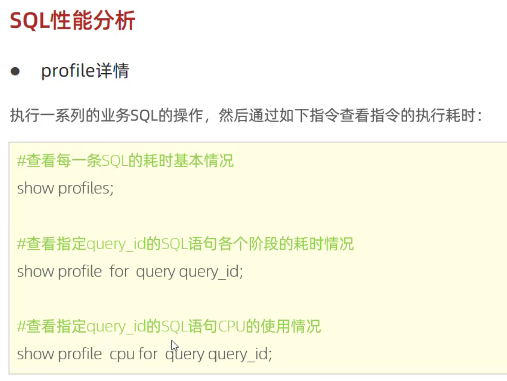

## MySQL 基础

- 概述
- SQL
- 函数
- 约束
- 多表查询
- 事务

### SQL

#### DDL（操作表结构，表中字段）

##### DDL 数据库操作

```SQL
-- 查询所有数据库
SHOW DATABASES;

-- 查询当前数据库
SELECT DATABASE();

-- 创建
CREATE DATABASE [IF NOT EXISTS] 数据库名 [DEFAULT CHARSET 字符集] [COLLATE 排序规则];

-- 删除
DROP DATABASE [IF EXISTS] 数据库名;

-- 使用
USE 数据库名;
```

##### DDL 表操作查询

```SQL
-- 查询当前数据库所有表
SHOW TABLES;

-- 查询表结构
DESC 表名;

-- 查询指定表的建表语句
SHOW CREATE TABLE 表名;
```

##### DDL 表操作创建

```SQL
CREATE 表名(
  字段1 字段1类型[COMMENT 字段1注释],
  字段2 字段2类型[COMMENT 字段2注释],
  ...
)[COMMENT 表注释]
```

##### DDL 表操作数据类型

1. 
2. 
3. 

##### DDL 表操作修改

```SQL
-- 添加字段
ALTER TABLE 表名 ADD 字段名 类型(长度) [COMMENT注释] [约束];

-- 修改字段类型
ALTER TABLE 表名 MODIFY 字段名 新数据类型(长度);

-- 修改字段名和字段类型
ALTER TABLE 表名 CHANGE 旧字段名 新字段名 类型(长度) [COMMENT注释] [约束];

-- 删除字段
ALTER TABLE 表名 DROP 字段名;

-- 修改表名
ALTER TABLE 表名 RENAME TO 新表名;
```

##### DDL 表操作删除

```SQL
-- 删除表
DROP TABLE [IF EXISTS] 表名;

-- 删除指定表，并重新创建该表
TRUNCATE TABLE 表名;
```

#### DML（数据增删改）

##### INSERT 添加数据

```SQL
-- 给指定字段添加数据
INSERT INTO 表名(字段名1，字段名2, ...) VALUES (值1, 值2, ...);

-- 给全部字段添加数据
INSERT INTO 表名 VALUES (值1, 值2, ...);

-- 批量添加数据
INSERT INTO 表名(字段名1，字段名2, ...) VALUES (值1, 值2, ...),(值1, 值2, ...),(值1, 值2, ...);
INSERT INTO 表名 VALUES (值1, 2值, ...),(值1, 值2, ...),(值1, 值2, ...);
```

注意：
1. 插入数据时，指定的字段顺序与值的顺序是一一对应的
2. 字符串和日期型数据应该包含在引号中
3. 插入的数据大小，应该在字段的规定范围内

##### UPDATE 修改数据

```SQL
UPDATE 表名 SET 字段名1 = 值1, 字段名2 = 值2, ... [WHERE 条件];
```

注意：
1. 没有条件则会修改整张表

##### DELETE 删除数据

```SQL
DELETE FROM 表名 [WHERE 条件];
```

注意：
1. 没有条件则会删除整张表
2. DELETE 语句不能删除某个字段的值（可以使用 update）

#### DQL（数据查询）

```SQL
-- 编写顺序
SELECT
  字段列表
FROM
  表名列表
WHERE
  条件列表
GROUP BY
  分组字段列表
HAVING
  分组后条件列表
ORDER BY
  排序字段列表
LIMIT
  分页参数
```

1. 
1. 

##### DQL - 基本查询

```sql
-- 查询多个字段
SELECT 字段1,字段2,字段3... FROM 表名;
SELECT * FROM 表名;

-- 设置别名
SELECT 字段1[AS 别名1], 字段2[AS 别名2] ... FROM 表名;

-- 去除重复记录
SELECT DISTINCT 字段列表 FROM 表名;
```

##### DQL - 条件查询

```sql
SELECT 字段1,字段2,字段3... FROM 表名 WHERE 条件列表;
```

1. 

##### DQL - 聚合函数

```sql
SELECT 聚合函数(字段列表) FROM 表名 WHERE 条件列表;
```

1. 

##### DQL - 分组查询

```sql
SELECT 字段, 聚合函数(字段列表) [别名] FROM 表名 [WHERE 条件列表] GROUP BY 分组字段名 [HAVING 分组后过滤条件];
```

1. 

##### DQL - 排序查询

```sql
SELECT 字段 [别名] FROM 表名 [WHERE 条件列表] ORDER BY 字段1 排序方式1, 字段2 排序方式2;
```

1. 

##### DQL - 分页查询

```sql
SELECT 字段 [别名] FROM 表名 LIMIT 起始索引,查询记录数;
```

1. 

#### DCL（数据控制语言，用来管理数据库用户，控制数据库的访问权限）

##### DCL - 管理用户

1. 

##### DCL - 权限控制

1. 
1. 

### 函数

#### 字符串函数

1. 

#### 数值函数

1. 

#### 日期函数

1. 

#### 流程函数

1. 

### 约束

#### 约束概念和分类

1. 

2. 

2. 

### 多表查询

#### 多表关系

1. 一对多：从表（多的一方）添加外键 绑定 主表（一的一方）主键
2. 多对多：添加中间表，中间表的两个外键关联两张表的主键
3. 一对一：任意表添加外键（唯一约束 UNIQUE 的外键）绑定另一张表主键

#### 多表查询 - 连接查询

1. 

2. 

3. 

4. 

5. 

#### 多表查询 - 子查询

1. 

2. 

3. 
3.1 

4. 

5. 

### 事务

#### 事务简介

事务是一组操作的集合，要么同时成功，要么同时失败

#### 事务操作

- 开启事务
  START TRANSACTION 或 BEGIN
- 提交事务
  COMMIT;
- 回滚事务
  ROLLBACK;

#### 事务四大特性


#### 并发事务问题


#### 事务隔离级别


## MySQL 进阶

- 存储引擎
- 索引
- SQL 优化
- 视图 / 存储过程 / 触发器
- 锁
- InnoDB 核心
- MySQL 管理

### 存储引擎


1. 在创建表时，指定存储引擎

```SQL
CREATE TABLE 表名(
字段 1 字段 1 类型
.....
字段 n 字段 n 类型
)ENGINE = INNODB[COMMENT 表注释];
```

2. 查看当前数据库支持的存储引擎

```SQL
SHOW ENGINES;
```

#### 存储引擎特点


##### InnoDB 存储引擎特点

- 介绍
  InnoDB 是一种兼顾高可靠性和高性能的通用存储引擎，在 MySOL 5.5 之后，InnoDB 是默认的 MySOL 存储引擎
- 特点
  DML 操作遵循 ACID 模型，支持事务
  行级锁，提高并发访问性能；
  支持外键 FOREIGN KEY 约束，保证数据的完整性和正确性
- 文件
  xXx.ibd: xxx 代表的是表名，innoDB 引警的每张表都会对应这样一个表空间文件，存储该表的表结构 (frm、sdi)、
  参数：innodb file per table


##### MyISAM 存储引擎特点

- 介绍
  MyISAM 是 MySOL 早期的默认存储引擎
- 特点
  不支持事务，不支持外键支持表锁，不支持行锁
  访问速度快
- 文件
  xxx.sdi: 存储表结构信息
  xxX.MYD: 存储数据
  xxx.MYI: 存储索

##### Memory 存储引擎特点

- 介绍
  Memory 引擎的表数据时存储在内存中的，由于受到硬件可题、或断电问题的影响，只能将这些表作为临时表或缓存使用
- 特点
  内存存放
  hash 索引 （默认）
- 文件
  xxx.sdi: 存储表结构信息

### 索引

#### 索引概述

- 介绍
  索引 (index) 是帮助 MSOL **高效获取数据的数据结构（有序）**。在数据之外，数据库系统还维护着满足特定查找算法的数据结构，这些数据结构以某种方式引用（指向）数据， 这样就可以在这些数据结构上实现高级查找算法，这种数据结构就是索引。


#### 索引结构

**为什么 InnoDB 存储引擎选择使用 B+tree 索引结构？**
  1. 相对于二叉树，层级更少，搜索效率高
  2.  对于 B-tree，无论是叶子节点还是非叶子节点，都会保存数据，这样导致一页中存储的键值减少，指针跟着减少，要同样保存大量数据，只能增加树的高度，导致性能降低
  3. 相对 Hash 索引，B+tree 支持范围匹配及排序操作


##### B+Tree 索引


.png)

##### Hash 索引


#### 索引分类


.png)

**InnoDB 主键索引的 B+tree 高度为多高呢？**
   假设：
  一行数据大小为 1k，一页中可以存储 16 行这样的数据。InnoDB 的指针占用 6 个字节的空间，主键即使为 bigint，占用字节数为 8。

  高度为 2:
  n*8+(n +1)*6= 16*1024, 算出 n 约为 1170
  1171* 16 = 18736

#### 索引语法


#### SOL 性能分析





#### 索引使用规则


- 范围查询
  联合索引中，出现范围查询 (>,<)，**范围查询右侧的列索引失效**

- 索引列运算
  不要在索引列上进行运算操作，索引将失效

- 字符串不加引号
  字符串类型字段使用时，不加引号，索引将失效

- 模糊查询
  如果仅仅是尾部模糊匹配，索引不会失效。如果是头部模糊匹配，索引失效。

- or 连接的条件
  用 or 分割开的条件，如果 or 前的条件中的列有索引，而后面的列中没有索引，那么涉及的索引都不会被用到。

- 数据分布影响
  如果 MySQL 评估使用索引比全表更慢，则不使用索引。


#### 索引设计原则


### SQL 优化

### 视图 / 存储过程 / 触发器

### 锁

### InnoDB 核心

### MySQL 管理

## 运维篇

- 日志
- 主从复制
- 分库分表
- 读写分离
