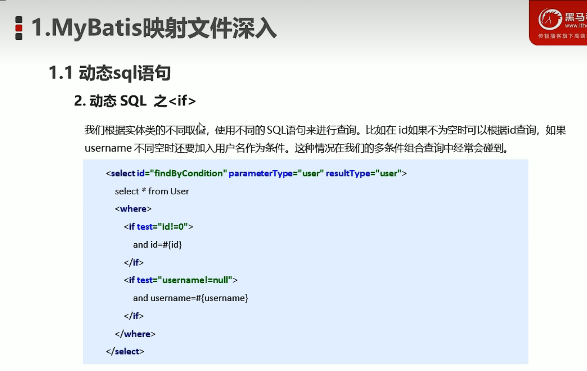
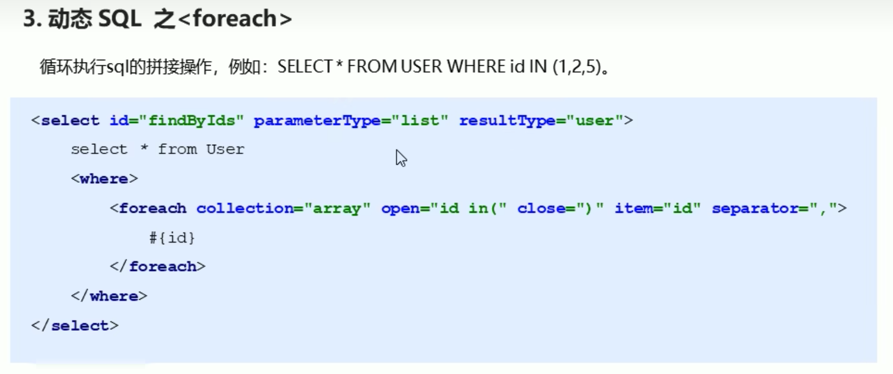
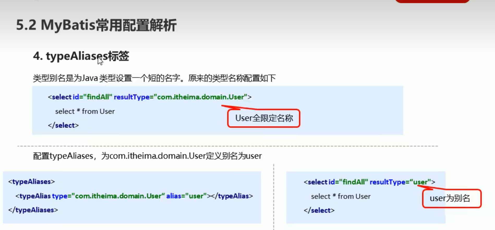

## MyBatis

#### 使用步骤

##### 步骤 1: 添加 mybatis 依赖

```xml
<dependency>
    <groupId>mysql</groupId>
    <artifactId>mysql-connector-java</artifactId>
    <version>5.1.46</version>
</dependency>
<dependency>
    <groupId>com.mybatis</groupId>
    <artifactId>mybatis</artifactId>
</dependency>
```

##### 步骤 2: 创建 user 数据表

##### 步骤 3: 编写 User 实体类

##### 步骤 4: 编写映射文件 UserMapper.xml

```xml
<!-- UserMapper.xml -->

<!-- ...省略约束头 -->
<mapper namespcace="userMapper">
  <select id="findAll" resultType="com.wwwwtao.domain.User">
    select * from user
  </select>
</mapper>
```

##### 步骤 5: 编写核心文件 SqlMapConfig.xml


##### 步骤 6: 编写测试代码


### MyBatis 映射文件






### MyBatis 增删改查


### MyBatis 核心配置文件

* configuration 配置
  * properties 属性
  * settings 设置
  * typeAliases 类型别名
  * typeHandlers 类型处理器
  * objectFactory 对象工厂
  * plugins 插件
  * environments 环境
    * environment 环境变量
      * transactionManager 事务管理器
      * dataSource 数据源
  * databaseIdProvider 数据库厂商标识
  * mappers 映射器





### MyBatis API


### MyBatis 的 DAO 层的开发方式


### MyBatis 多表操作


