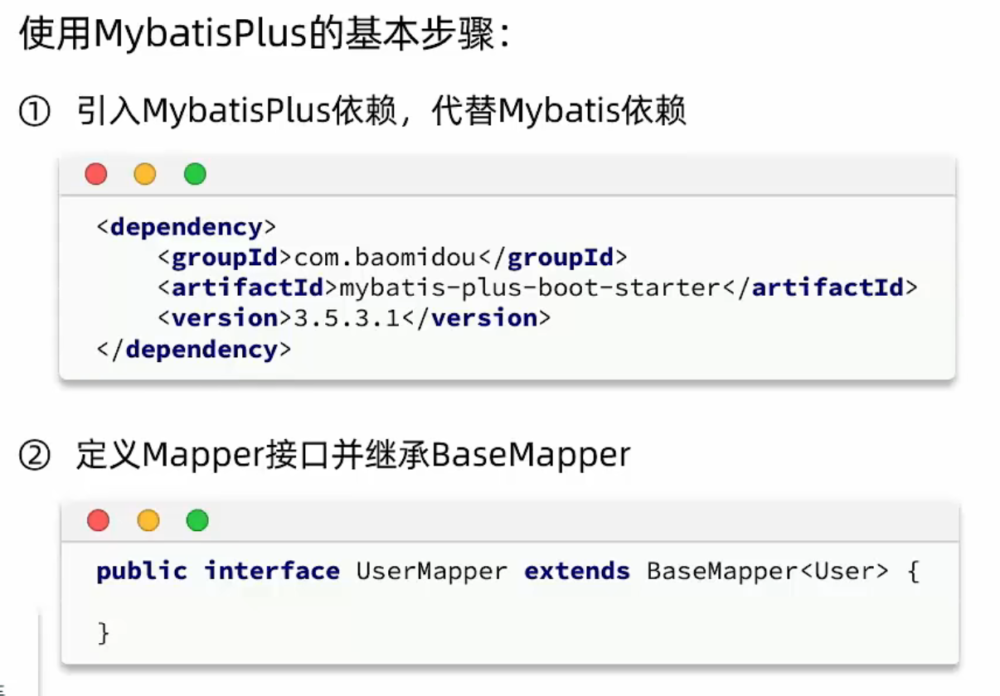
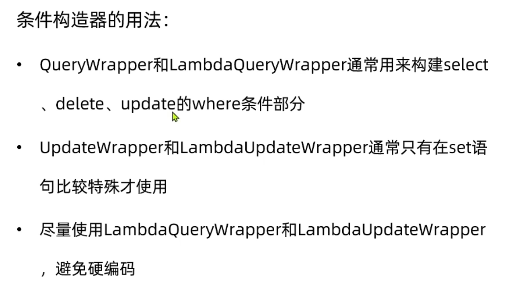
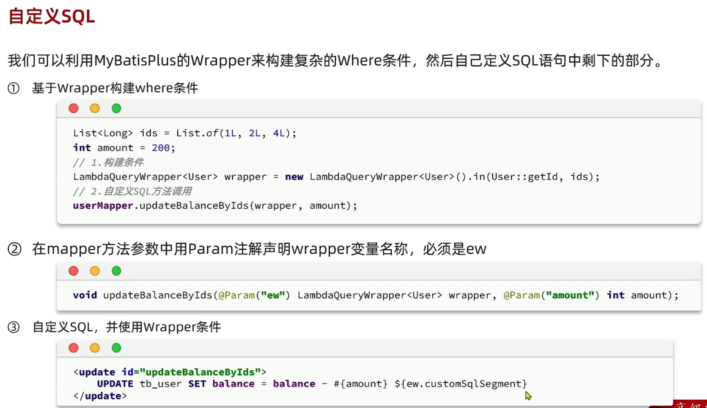
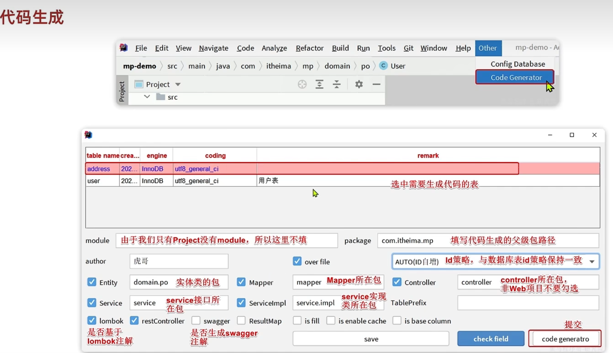

## 快速入门

`<a href="https://baomidou.com/pages/223848/#tablefield">`
  Mybatisplus 注解
`</a>`

## 核心

### 条件构造器 Wrapper

### 自定义 SQL

### IService

👌。基本明白了

### 风格指南

1. 简单的业务就不写 `service` 和 `mapper`.  -- 直接 `controller` 里调用 `IService` 调用 `baseMapper` 里的方法实现
2. 复杂的业务就自定义 `service` 和 `mapper` -- 在 XML 里维护 `SQL`
   （这里什么情况用 **Wrapper || XML || (Wrapper && X****ML)** 要找到统一的风格进行取舍）

### IDEA--MyBatisPlus插件

