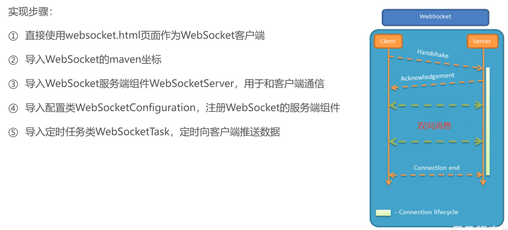

### nginx负载均衡策略


### Swagger


### redis

#### 五种常用数据类型介绍

Redis 存储的是 key-value 结构的数据，其中 key 是字符串类型，value 有 5 种常用的数据类型：

- 字符串 (string)：普通字符串，Redis 中最简单的数据类型
- 哈希 (hash)：也叫散列，类似于 Java 中的 HashMap 结构
- 列表 (list)：按照插入顺序排序，可以有重复元素，类似于 Java 中的 LinkedList
- 集合 (set)：无序集合，没有重复元素，类似于 Java 中的 HashSet
- 有序集合 (sorted set/zset)：集合中每个元素关联一个分数 (score)，根据分数升序排序，没有重复元素

#### Redis 常用命令 更多命令可以参考 Redis 中文网：https://www.redis.net.cn

##### 字符串类型常用命令

- SET key value 设置指定 key 的值
- GET key 获取指定 key 的值
- SETEX key seconds value 设置指定 key 的值，并将 key 的过期时间设为 seconds 秒 （应用场景：短信验证码）
- SETNX key value 只有在 key 不存在时设置 key 的值

##### 哈希操作命令

Redis hash 是一个 string 类型的 field 和 value 的映射表，hash 特别适合用于存储对象，常用命令：

- HSET key field value 将哈希表 key 中的字段 field 的值设为 value
- HGET key field 获取存储在哈希表中指定字段的值
- HDEL key field 删除存储在哈希表中的指定字段
- HKEYS key 获取哈希表中所有字段
- HVALS key 获取哈希表中所有值

##### 列表操作命令

Redis 列表是简单的字符串列表，按照插入顺序排序，常用命令：

- LPUSH key value1 [value2] 将一个或多个值插入到列表头部
- LRANGE key start stop 获取列表指定范围内的元素
- RPOP key 移除并获取列表最后一个元素
- LLEN key 获取列表长度
- BRPOP key1 [key2 ] timeout 移出并获取列表的最后一个元素，如果列表没有元素会阻塞列表直到等待超 时或发现可弹出元素为止

##### 集合操作命令

Redis set 是 string 类型的无序集合。集合成员是唯一的，这就意味着集合中不能出现重复的数据，常用命令：

- SADD key member1 [member2] 向集合添加一个或多个成员
- SMEMBERS key 返回集合中的所有成员
- SCARD key 获取集合的成员数
- SINTER key1 [key2] 返回给定所有集合的交集
- SUNION key1 [key2] 返回所有给定集合的并集
- SREM key member1 [member2] 移除集合中一个或多个成员

##### 有序集合操作命令

Redis 有序集合是 string 类型元素的集合，且不允许有重复成员。每个元素都会关联一个 double 类型的分数。常用命令：

- ZADD key score1 member1 [score2 member2] 向有序集合添加一个或多个成员
- ZRANGE key start stop [WITHSCORES] 通过索引区间返回有序集合中指定区间内的成员
- ZINCRBY key increment member 有序集合中对指定成员的分数加上增量 increment
- ZREM key member [member …] 移除有序集合中的一个或多个成员

##### 通用命令

Redis 的通用命令是不分数据类型的，都可以使用的命令：

- KEYS pattern 查找所有符合给定模式 ( pattern) 的 key
- EXISTS key 检查给定 key 是否存在
- TYPE key 返回 key 所储存的值的类型
- DEL key 该命令用于在 key 存在是删除 key

#### Spring Data Redis 使用方式


```java
/*

测试Spring Data Redis 使用方式 (https://www.bilibili.com/video/BV1TP411v7v6/?p=62&spm_id_from=pageDriver&vd_source=c7a7e5965d0ae56d14c265a3cf9cb50f)

/Users/wwwwtao/Desktop/学习/程序员课程源码/黑马程序员Java项目《苍穹外卖》企业级开发实战/资料/day01/后端初始工程/sky-take-out/sky-server/src/test/java/com/sky/test/SpringDataRedisTest.java

*/
package com.sky.test;

import org.junit.jupiter.api.Test;
import org.springframework.beans.factory.annotation.Autowired;
import org.springframework.boot.test.context.SpringBootTest;
import org.springframework.data.redis.core.*;

@SpringBootTest
public class SpringDataRedisTest {

    @Autowired
    private RedisTemplate redisTemplate;

    @Test
    public void testRedisTemplate(){
        System.out.println(redisTemplate);
        ValueOperations valueOperations = redisTemplate.opsForValue();
        HashOperations hashOperations = redisTemplate.opsForHash();
        ListOperations listOperations = redisTemplate.opsForList();
        SetOperations setOperations = redisTemplate.opsForSet();
        ZSetOperations zSetOperations = redisTemplate.opsForZSet();
    }

    /**
     * 操作字符串类型的数据
     */
    @Test
    public void testString(){
        //set get setex SETNX
        ValueOperations valueOperations = redisTemplate.opsForValue();
        valueOperations.set("city","长沙");
        String city = (String) valueOperations.get("city");
        System.out.println(city);

        valueOperations.set("code","1234",3, TimeUnit.MINUTES);
        valueOperations.setIfAbsent("lock","1");
        valueOperations.setIfAbsent("lock","2 ");
    }

    /**
     * 操作哈希类型的命令
     */
    @Test
    public void testHash(){
        // hset hget hdel hkeys hvals
        HashOperations hashOperations = redisTemplate.opsForHash();
        hashOperations.put("100", "name", "tom");
        hashOperations.put("100", "age", "25");

        Object name = hashOperations.get("100", "name");
        System.out.println(name);

        Set keys = hashOperations.keys("100");
        System.out.println(keys);
        List values = hashOperations.values("100");
        System.out.println(values);

        hashOperations.delete("100","age");
    }
}

```

### HttpClient


<!-- HttpClientUtil.class -->

```java
package com.sky.utils;

import com.alibaba.fastjson.JSONObject;
import org.apache.http.NameValuePair;
import org.apache.http.client.config.RequestConfig;
import org.apache.http.client.entity.UrlEncodedFormEntity;
import org.apache.http.client.methods.CloseableHttpResponse;
import org.apache.http.client.methods.HttpGet;
import org.apache.http.client.methods.HttpPost;
import org.apache.http.client.utils.URIBuilder;
import org.apache.http.entity.StringEntity;
import org.apache.http.impl.client.CloseableHttpClient;
import org.apache.http.impl.client.HttpClients;
import org.apache.http.message.BasicNameValuePair;
import org.apache.http.util.EntityUtils;

import java.io.IOException;
import java.net.URI;
import java.util.ArrayList;
import java.util.List;
import java.util.Map;

/**
 * Http工具类
 */
public class HttpClientUtil {

    static final  int TIMEOUT_MSEC = 5 * 1000;

    /**
     * 发送GET方式请求
     * @param url
     * @param paramMap
     * @return
     */
    public static String doGet(String url,Map<String,String> paramMap){
        // 创建Httpclient对象
        CloseableHttpClient httpClient = HttpClients.createDefault();

        String result = "";
        CloseableHttpResponse response = null;

        try{
            URIBuilder builder = new URIBuilder(url);
            if(paramMap != null){
                for (String key : paramMap.keySet()) {
                    builder.addParameter(key,paramMap.get(key));
                }
            }
            URI uri = builder.build();

            //创建GET请求
            HttpGet httpGet = new HttpGet(uri);

            //发送请求
            response = httpClient.execute(httpGet);

            //判断响应状态
            if(response.getStatusLine().getStatusCode() == 200){
                result = EntityUtils.toString(response.getEntity(),"UTF-8");
            }
        }catch (Exception e){
            e.printStackTrace();
        }finally {
            try {
                response.close();
                httpClient.close();
            } catch (IOException e) {
                e.printStackTrace();
            }
        }

        return result;
    }

    /**
     * 发送POST方式请求
     * @param url
     * @param paramMap
     * @return
     * @throws IOException
     */
    public static String doPost(String url, Map<String, String> paramMap) throws IOException {
        // 创建Httpclient对象
        CloseableHttpClient httpClient = HttpClients.createDefault();
        CloseableHttpResponse response = null;
        String resultString = "";

        try {
            // 创建Http Post请求
            HttpPost httpPost = new HttpPost(url);

            // 创建参数列表
            if (paramMap != null) {
                List<NameValuePair> paramList = new ArrayList();
                for (Map.Entry<String, String> param : paramMap.entrySet()) {
                    paramList.add(new BasicNameValuePair(param.getKey(), param.getValue()));
                }
                // 模拟表单
                UrlEncodedFormEntity entity = new UrlEncodedFormEntity(paramList);
                httpPost.setEntity(entity);
            }

            httpPost.setConfig(builderRequestConfig());

            // 执行http请求
            response = httpClient.execute(httpPost);

            resultString = EntityUtils.toString(response.getEntity(), "UTF-8");
        } catch (Exception e) {
            throw e;
        } finally {
            try {
                response.close();
            } catch (IOException e) {
                e.printStackTrace();
            }
        }

        return resultString;
    }

    /**
     * 发送POST方式请求
     * @param url
     * @param paramMap
     * @return
     * @throws IOException
     */
    public static String doPost4Json(String url, Map<String, String> paramMap) throws IOException {
        // 创建Httpclient对象
        CloseableHttpClient httpClient = HttpClients.createDefault();
        CloseableHttpResponse response = null;
        String resultString = "";

        try {
            // 创建Http Post请求
            HttpPost httpPost = new HttpPost(url);

            if (paramMap != null) {
                //构造json格式数据
                JSONObject jsonObject = new JSONObject();
                for (Map.Entry<String, String> param : paramMap.entrySet()) {
                    jsonObject.put(param.getKey(),param.getValue());
                }
                StringEntity entity = new StringEntity(jsonObject.toString(),"utf-8");
                //设置请求编码
                entity.setContentEncoding("utf-8");
                //设置数据类型
                entity.setContentType("application/json");
                httpPost.setEntity(entity);
            }

            httpPost.setConfig(builderRequestConfig());

            // 执行http请求
            response = httpClient.execute(httpPost);

            resultString = EntityUtils.toString(response.getEntity(), "UTF-8");
        } catch (Exception e) {
            throw e;
        } finally {
            try {
                response.close();
            } catch (IOException e) {
                e.printStackTrace();
            }
        }

        return resultString;
    }
    private static RequestConfig builderRequestConfig() {
        return RequestConfig.custom()
                .setConnectTimeout(TIMEOUT_MSEC)
                .setConnectionRequestTimeout(TIMEOUT_MSEC)
                .setSocketTimeout(TIMEOUT_MSEC).build();
    }

}

```

### Spring Cache


### Spring Task

1. 导入 maven 坐标 spring-context（已存在）
2. 启动类添加注解 @EnableScheduling 开启任务调度
3. 自定义定时任务类 @Scheduled

#### cron 表达式 表达式生成器:https://qqe2.com/dev/cron

### WebSocket 视频教程:https://www.bilibili.com/video/BV1TP411v7v6/?p=130&spm_id_from=pageDriver&vd_source=c7a7e5965d0ae56d14c265a3cf9cb50f



### Apache POI 视频教程:https://www.bilibili.com/video/BV1TP411v7v6/?p=165&spm_id_from=pageDriver&vd_source=c7a7e5965d0ae56d14c265a3cf9cb50f

```java
/**
 * 使用POI操作Excel文件
 */
public class POITest {
    /**
     * 通过POI创建Excel文件并且写入文件内容
     */
    public static void write() throws Exception{
        //在内存中创建一个Excel文件
        XSSFWorkbook excel = new XSSFWorkbook();
        //在Excel文件中创建一个Sheet页
        XSSFSheet sheet = excel.createSheet("info");
        //在Sheet中创建行对象,rownum编号从0开始
        XSSFRow row = sheet.createRow(1);
        //创建单元格并且写入文件内容
        row.createCell(1).setCellValue("姓名");
        row.createCell(2).setCellValue("城市");

        //创建一个新行
        row = sheet.createRow(2);
        row.createCell(1).setCellValue("张三");
        row.createCell(2).setCellValue("北京");

        row = sheet.createRow(3);
        row.createCell(1).setCellValue("李四");
        row.createCell(2).setCellValue("南京");

        //通过输出流将内存中的Excel文件写入到磁盘
        FileOutputStream out = new FileOutputStream(new File("D:\\info.xlsx"));
        excel.write(out);

        //关闭资源
        out.close();
        excel.close();
    }


    /**
     * 通过POI读取Excel文件中的内容
     * @throws Exception
     */
    public static void read() throws Exception{
        InputStream in = new FileInputStream(new File("D:\\info.xlsx"));

        //读取磁盘上已经存在的Excel文件
        XSSFWorkbook excel = new XSSFWorkbook(in);
        //读取Excel文件中的第一个Sheet页
        XSSFSheet sheet = excel.getSheetAt(0);

        //获取Sheet中最后一行的行号
        int lastRowNum = sheet.getLastRowNum();

        for (int i = 1; i <= lastRowNum ; i++) {
            //获得某一行
            XSSFRow row = sheet.getRow(i);
            //获得单元格对象
            String cellValue1 = row.getCell(1).getStringCellValue();
            String cellValue2 = row.getCell(2).getStringCellValue();
            System.out.println(cellValue1 + " " + cellValue2);
        }

        //关闭资源
        in.close();
        excel.close();
    }

    public static void main(String[] args) throws Exception {
        write();
        read();
    }
}
```