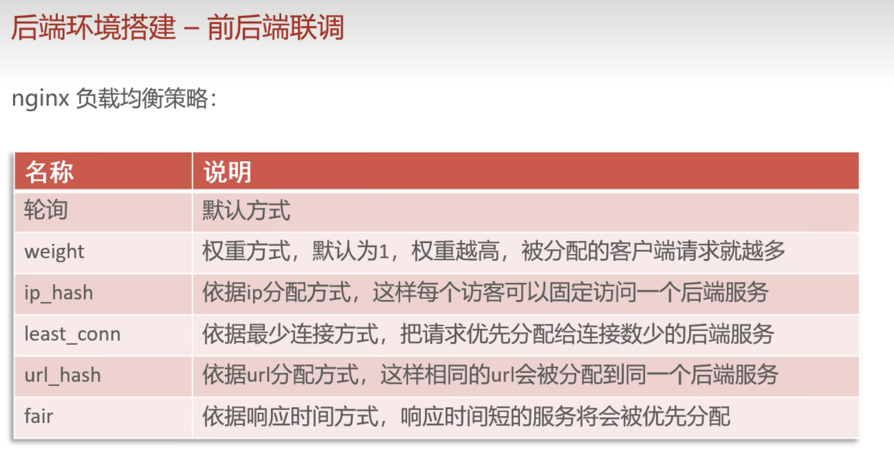
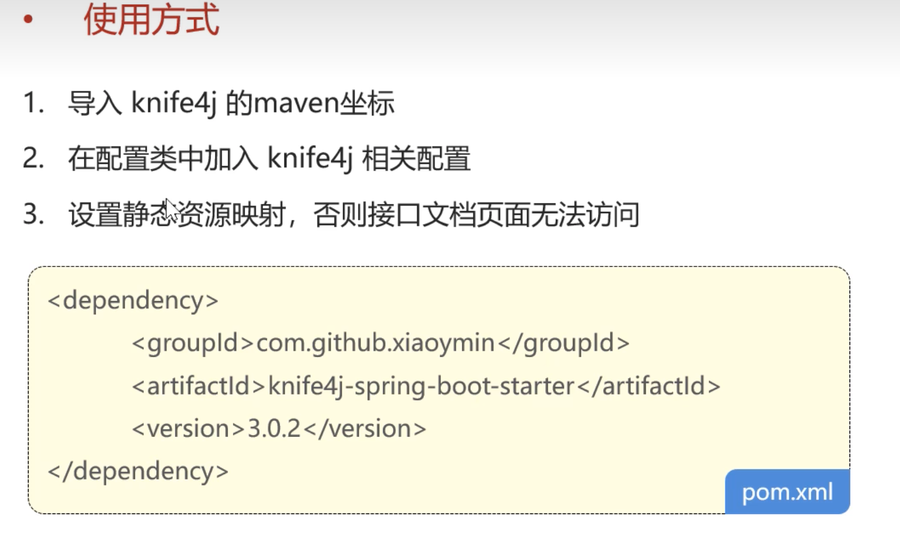
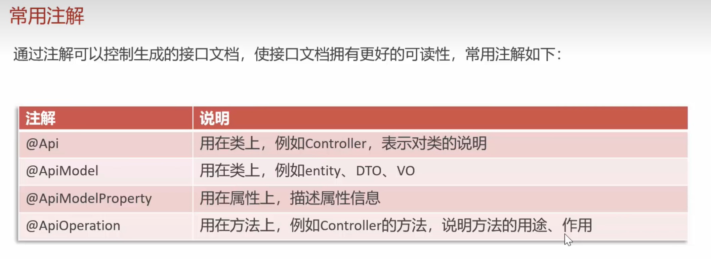
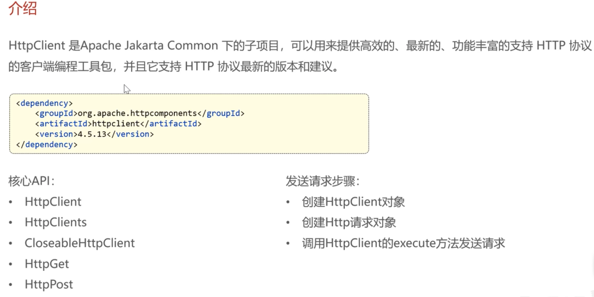
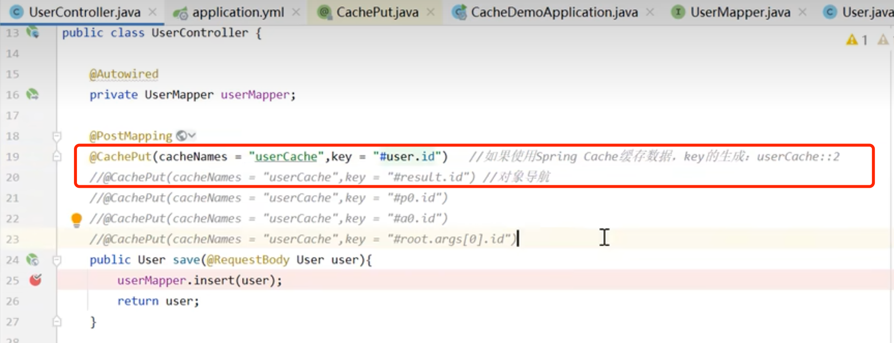
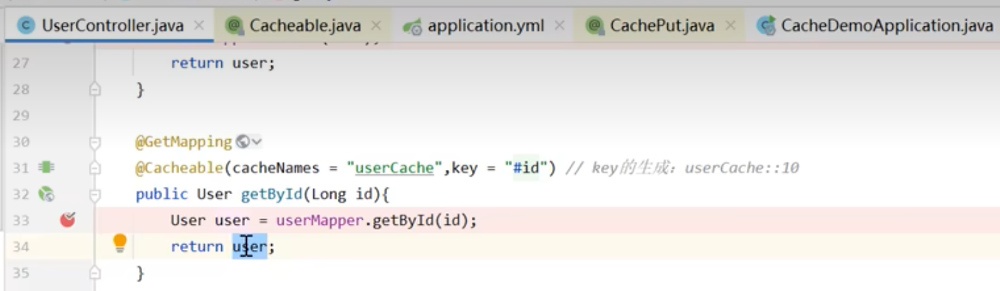
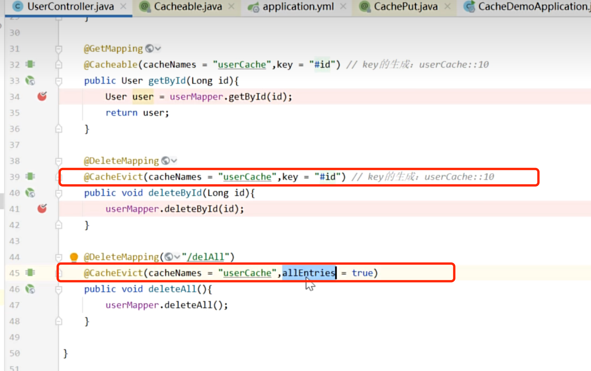

### nginx



### Swagger




### redis

#### 五种常用数据类型介绍

Redis 存储的是 key-value 结构的数据，其中 key 是字符串类型，value 有 5 种常用的数据类型：

- 字符串 (string)：普通字符串，Redis 中最简单的数据类型
- 哈希 (hash)：也叫散列，类似于 Java 中的 HashMap 结构
- 列表 (list)：按照插入顺序排序，可以有重复元素，类似于 Java 中的 LinkedList
- 集合 (set)：无序集合，没有重复元素，类似于 Java 中的 HashSet
- 有序集合 (sorted set/zset)：集合中每个元素关联一个分数 (score)，根据分数升序排序，没有重复元素

#### Redis 常用命令 更多命令可以参考 Redis 中文网：https://www.redis.net.cn

##### 字符串类型常用命令

- SET key value 设置指定 key 的值
- GET key 获取指定 key 的值
- SETEX key seconds value 设置指定 key 的值，并将 key 的过期时间设为 seconds 秒 （应用场景：短信验证码）
- SETNX key value 只有在 key 不存在时设置 key 的值

##### 哈希操作命令

Redis hash 是一个 string 类型的 field 和 value 的映射表，hash 特别适合用于存储对象，常用命令：

- HSET key field value 将哈希表 key 中的字段 field 的值设为 value
- HGET key field 获取存储在哈希表中指定字段的值
- HDEL key field 删除存储在哈希表中的指定字段
- HKEYS key 获取哈希表中所有字段
- HVALS key 获取哈希表中所有值

##### 列表操作命令

Redis 列表是简单的字符串列表，按照插入顺序排序，常用命令：

- LPUSH key value1 [value2] 将一个或多个值插入到列表头部
- LRANGE key start stop 获取列表指定范围内的元素
- RPOP key 移除并获取列表最后一个元素
- LLEN key 获取列表长度
- BRPOP key1 [key2 ] timeout 移出并获取列表的最后一个元素，如果列表没有元素会阻塞列表直到等待超 时或发现可弹出元素为止

##### 集合操作命令

Redis set 是 string 类型的无序集合。集合成员是唯一的，这就意味着集合中不能出现重复的数据，常用命令：

- SADD key member1 [member2] 向集合添加一个或多个成员
- SMEMBERS key 返回集合中的所有成员
- SCARD key 获取集合的成员数
- SINTER key1 [key2] 返回给定所有集合的交集
- SUNION key1 [key2] 返回所有给定集合的并集
- SREM key member1 [member2] 移除集合中一个或多个成员

##### 有序集合操作命令

Redis 有序集合是 string 类型元素的集合，且不允许有重复成员。每个元素都会关联一个 double 类型的分数。常用命令：

- ZADD key score1 member1 [score2 member2] 向有序集合添加一个或多个成员
- ZRANGE key start stop [WITHSCORES] 通过索引区间返回有序集合中指定区间内的成员
- ZINCRBY key increment member 有序集合中对指定成员的分数加上增量 increment
- ZREM key member [member …] 移除有序集合中的一个或多个成员

##### 通用命令

Redis 的通用命令是不分数据类型的，都可以使用的命令：

- KEYS pattern 查找所有符合给定模式 ( pattern) 的 key
- EXISTS key 检查给定 key 是否存在
- TYPE key 返回 key 所储存的值的类型
- DEL key 该命令用于在 key 存在是删除 key

#### Spring Data Redis 使用方式


```java
/*

测试Spring Data Redis 使用方式 (https://www.bilibili.com/video/BV1TP411v7v6/?p=62&spm_id_from=pageDriver&vd_source=c7a7e5965d0ae56d14c265a3cf9cb50f)

/Users/wwwwtao/Desktop/学习/程序员课程源码/黑马程序员Java项目《苍穹外卖》企业级开发实战/资料/day01/后端初始工程/sky-take-out/sky-server/src/test/java/com/sky/test/SpringDataRedisTest.java

*/
package com.sky.test;

import org.junit.jupiter.api.Test;
import org.springframework.beans.factory.annotation.Autowired;
import org.springframework.boot.test.context.SpringBootTest;
import org.springframework.data.redis.core.*;

@SpringBootTest
public class SpringDataRedisTest {

    @Autowired
    private RedisTemplate redisTemplate;

    @Test
    public void testRedisTemplate(){
        System.out.println(redisTemplate);
        ValueOperations valueOperations = redisTemplate.opsForValue();
        HashOperations hashOperations = redisTemplate.opsForHash();
        ListOperations listOperations = redisTemplate.opsForList();
        SetOperations setOperations = redisTemplate.opsForSet();
        ZSetOperations zSetOperations = redisTemplate.opsForZSet();
    }

    /**
     * 操作字符串类型的数据
     */
    @Test
    public void testString(){
        //set get setex SETNX
        ValueOperations valueOperations = redisTemplate.opsForValue();
        valueOperations.set("city","长沙");
        String city = (String) valueOperations.get("city");
        System.out.println(city);

        valueOperations.set("code","1234",3, TimeUnit.MINUTES);
        valueOperations.setIfAbsent("lock","1");
        valueOperations.setIfAbsent("lock","2 ");
    }

    /**
     * 操作哈希类型的命令
     */
    @Test
    public void testHash(){
        // hset hget hdel hkeys hvals
        HashOperations hashOperations = redisTemplate.opsForHash();
        hashOperations.put("100", "name", "tom");
        hashOperations.put("100", "age", "25");

        Object name = hashOperations.get("100", "name");
        System.out.println(name);

        Set keys = hashOperations.keys("100");
        System.out.println(keys);
        List values = hashOperations.values("100");
        System.out.println(values);

        hashOperations.delete("100","age");
    }
}

```

### HttpClient



### Spring Cache





