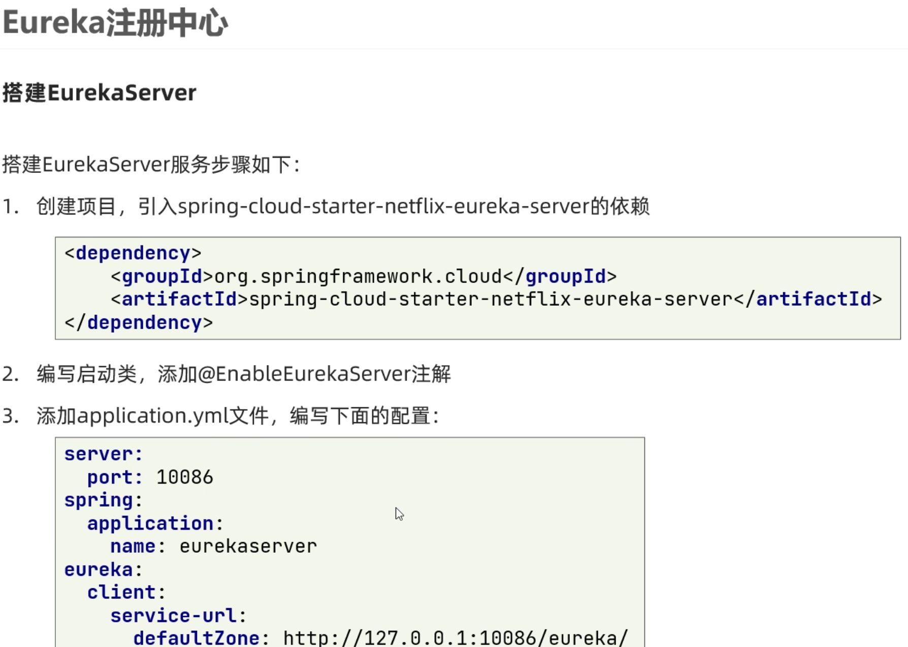
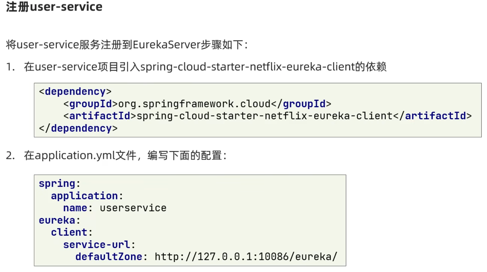
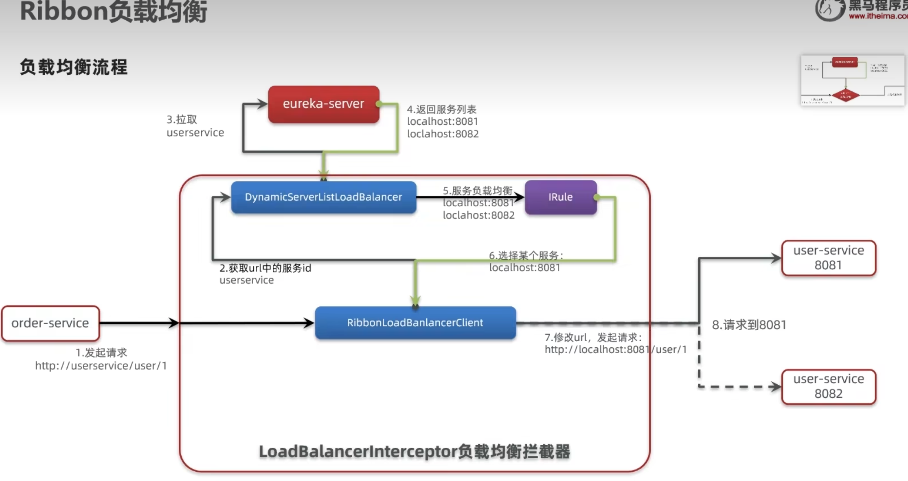
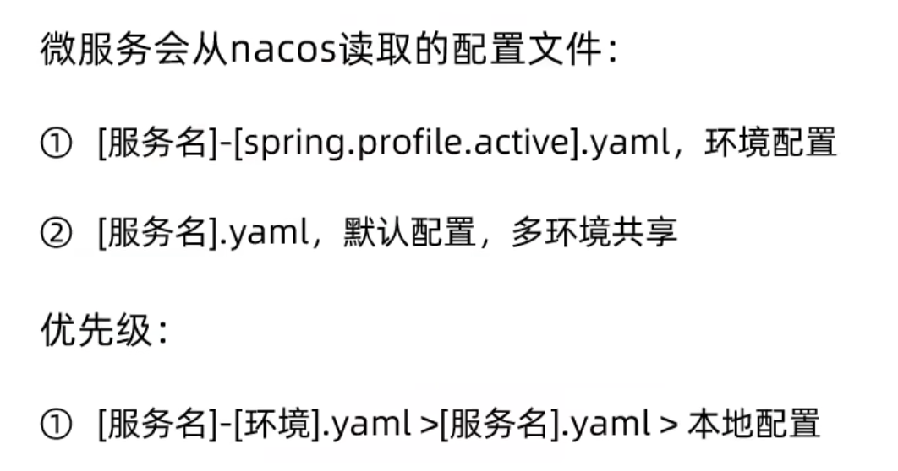

### Eureka 注册中心

在 Eureka 架构中，微服务角色有两类

1. EurekaServer: 服务端，注册中心

- 记录服务信息
- 心跳监控

2. EurekaClient: 客户端

  Provider: 服务提供者，例如案例中的 user-service
  - 注册自己的信息到 EurekaServer
  - 每隔 30 秒向 EurekaServer 发送心跳

  consumer: 服务消费者，例如案例中的 order-service
  - 根据服务名称从 EurekaServer 拉取服务列表
  - 基于服务列表做负载均衡，选中一个微服务后发起远程调用

**搭建 Eureka 服务，服务注册，服务发现**





### Ribbon

#### Ribbon 负载均衡原理

SpringCloudRibbon 的底层采用了一个拦截器，拦截了 RestTemplate 发出的请求，对地址做了修改。用一幅图来总结一下：


基本流程如下：

- 拦截我们的 RestTemplate 请求 http://userservice/user/1
- RibbonLoadBalancerClient 会从请求 url 中获取服务名称，也就是 user-service
- DynamicServerListLoadBalancer 根据 user-service 到 eureka 拉取服务列表
- eureka 返回列表，localhost:8081、localhost:8082
- IRule 利用内置负载均衡规则，从列表中选择一个，例如 localhost:8081
- RibbonLoadBalancerClient 修改请求地址，用 localhost:8081 替代 userservice，得到 http://localhost:8081/user/1，发起真实请求

#### 负载均衡策略

负载均衡的规则都定义在 IRule 接口中，而 IRule 有很多不同的实现类：


不同规则的含义如下：

| **内置负载均衡规则类**    | **规则描述**                                                 |
| ------------------------- | ------------------------------------------------------------ |
| RoundRobinRule            | 简单轮询服务列表来选择服务器。它是 Ribbon 默认的负载均衡规则。 |
| AvailabilityFilteringRule | 对以下两种服务器进行忽略：   （1）在默认情况下，这台服务器如果 3 次连接失败，这台服务器就会被设置为“短路”状态。短路状态将持续 30 秒，如果再次连接失败，短路的持续时间就会几何级地增加。  （2）并发数过高的服务器。如果一个服务器的并发连接数过高，配置了 AvailabilityFilteringRule 规则的客户端也会将其忽略。并发连接数的上限，可以由客户端的<clientName>.<clientConfigNameSpace>.ActiveConnectionsLimit 属性进行配置。 |
| WeightedResponseTimeRule  | 为每一个服务器赋予一个权重值。服务器响应时间越长，这个服务器的权重就越小。这个规则会随机选择服务器，这个权重值会影响服务器的选择。 |
| **ZoneAvoidanceRule**     | 以区域可用的服务器为基础进行服务器的选择。使用 Zone 对服务器进行分类，这个 Zone 可以理解为一个机房、一个机架等。而后再对 Zone 内的多个服务做轮询。 |
| BestAvailableRule         | 忽略那些短路的服务器，并选择并发数较低的服务器。             |
| RandomRule                | 随机选择一个可用的服务器。                                   |
| RetryRule                 | 重试机制的选择逻辑                                           |

默认的实现就是 ZoneAvoidanceRule，是一种轮询方案

#### 自定义负载均衡策略

通过定义 IRule 实现可以修改负载均衡规则，有两种方式：

1. 代码方式：在 order-service 中的 OrderApplication 类中，定义一个新的 IRule：

```java
@Bean
public IRule randomRule(){
    return new RandomRule();
}
```

2. 配置文件方式：在 order-service 的 application.yml 文件中，添加新的配置也可以修改规则：

```yaml
userservice: # 给某个微服务配置负载均衡规则，这里是userservice服务
  ribbon:
    NFLoadBalancerRuleClassName: com.netflix.loadbalancer.RandomRule # 负载均衡规则
```

> **注意**，一般用默认的负载均衡规则，不做修改。

#### 饥饿加载

Ribbon 默认是采用懒加载，即第一次访问时才会去创建 LoadBalanceClient，请求时间会很长。

而饥饿加载则会在项目启动时创建，降低第一次访问的耗时，通过下面配置开启饥饿加载：

```yaml
ribbon:
  eager-load:
    enabled: true
    clients: userservice
```

### Nacos

#### 服务分级存储模型

一个**服务**可以有多个**实例**, Nacos 就将同一机房内的实例 划分为一个**集群**。

```yaml
# 给 user-service 配置集群，修改 user-service 的 application.yml 文件，添加集群配置：
spring:
  cloud:
    nacos:
      server-addr: localhost:8848
      discovery:
        cluster-name: HZ # 集群名称
```

**同集群优先**的负载均衡默认的`ZoneAvoidanceRule`并不能实现根据同集群优先来实现负载均衡。因此 Nacos 中提供了一个`NacosRule`的实现，可以优先从同集群中挑选实例。

```yaml
# 1）给order-service配置集群信息
# 修改order-service的application.yml文件，添加集群配置：
spring:
  cloud:
    nacos:
      server-addr: localhost:8848
      discovery:
        cluster-name: HZ # 集群名称

# 2）修改负载均衡规则
# 修改order-service的application.yml文件，修改负载均衡规则：
userservice:
  ribbon:
    NFLoadBalancerRuleClassName: com.alibaba.cloud.nacos.ribbon.NacosRule # 负载均衡规则
```

#### 权重配置

在 nacos 控制台，找到 user-service 的实例列表，点击编辑，即可修改权重：
> **注意**：如果权重修改为 0，则该实例永远不会被访问

#### 环境隔离

Nacos 提供了 namespace 来实现环境隔离功能。

- nacos 中可以有多个 namespace
- namespace 下可以有 group、service 等
- 不同 namespace 之间相互隔离，例如不同 namespace 的服务互相不可见

#### Nacos 与 Eureka 的区别

Nacos 的服务实例分为两种类型：
- 临时实例：如果实例宕机超过一定时间，会从服务列表剔除，默认的类型。
- 非临时实例：如果实例宕机，不会从服务列表剔除，也可以叫永久实例。

```yaml
spring:
  cloud:
    nacos:
      discovery:
        ephemeral: false # 设置为非临时实例
```

- Nacos 与 eureka 的共同点
  - 都支持服务注册和服务拉取
  - 都支持服务提供者心跳方式做健康检测

- Nacos 与 Eureka 的区别
  - Nacos 支持服务端主动检测提供者状态：临时实例采用心跳模式，非临时实例采用主动检测模式
  - 临时实例心跳不正常会被剔除，非临时实例则不会被剔除
  - Nacos 支持服务列表变更的消息推送模式，服务列表更新更及时
  - Nacos 集群默认采用 AP 方式，当集群中存在非临时实例时，采用 CP 模式；Eureka 采用 AP 方式

#### 从微服务拉取配置

微服务要拉取 nacos 中管理的配置，并且与本地的 application.yml 配置合并，才能完成项目启动。
因此 spring 引入了一种新的配置文件：`bootstrap.yaml`文件，会在 application.yml 之前被读取，流程如下：

```xml
<!-- 首先，在user-service服务中，引入nacos-config的客户端依赖： -->
<!--nacos配置管理依赖-->
<dependency>
    <groupId>com.alibaba.cloud</groupId>
    <artifactId>spring-cloud-starter-alibaba-nacos-config</artifactId>
</dependency>
```

```yaml
# 然后，在user-service中添加一个bootstrap.yaml文件，内容如下：
spring:
  application:
    name: userservice # 服务名称
  profiles:
    active: dev #开发环境，这里是dev
  cloud:
    nacos:
      server-addr: localhost:8848 # Nacos地址
      config:
        file-extension: yaml # 文件后缀名
```

这里会根据 spring.cloud.nacos.server-addr 获取 nacos 地址，再根据

`${spring.application.name}-${spring.profiles.active}.${spring.cloud.nacos.config.file-extension}`作为文件 id，来读取配置。

本例中，就是去读取`userservice-dev.yaml`：

#### 配置热更新

我们最终的目的，是修改 nacos 中的配置后，微服务中无需重启即可让配置生效，也就是**配置热更新**。

1. 方式一：在 @Value 注入的变量所在类上添加注解 @RefreshScope：

2. 方式二：使用 @ConfigurationProperties 注解代替 @Value 注解。在 user-service 服务中，添加一个类，读取 patterrn.dateformat 属性：

```java
package cn.itcast.user.config;

import lombok.Data;
import org.springframework.boot.context.properties.ConfigurationProperties;
import org.springframework.stereotype.Component;

@Component
@Data
@ConfigurationProperties(prefix = "pattern")
public class PatternProperties {
    private String dateformat;
}
```

#### 多环境共享



#### 集群搭建 -- 参考课前资料


### Http 客户端 Feign


### 统一网关 Gateway


