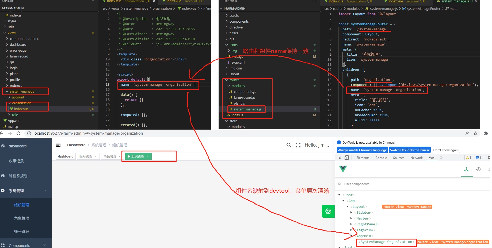

1.$router 为 VueRouter 实例，想要导航到不同 URL，则使用 $router.push 方法
2.$route 为当前 router 跳转对象，里面可以获取 name、path、query、params 等

query  传递的参数在问号后面 键值对的形式
params 传递的参数在路径后面 直接显示值  （如果路由中的 path 后面参数不写，那么就不会在地址栏上显示  而且刷新页面参数会消失，写上参数刷新页面 参数不会消失）

另外，二者还有点区别，
注意：params 传参，只能用 name 来引入路由！!!   （如果这里写成了 path，接收参数页面会是 undefined！！！

### this.$route.query的使用
```js
 1、router/index.js

    {
      path:'/mtindex',
      component: mtindex,
      //添加路由
      children:[
       {
       	path:':shopid',
       	component:guessdetail
       }
      ]
    }

2、传参数
  this.$router.push({
      path: '/mtindex/detail', query:{shopid: item.id}
  });

3、获取参数

  this.$route.query.shopid

4、url的表现形式(url中带有参数)

  http://localhost:8080/#/mtindex/detail?shopid=1
```
### this.$route.params
```js
1、router/index.js
  {
    path:'/mtindex',
    component: mtindex,
    //添加路由
    children:[
     {
     	path:':shopid',
     	component:guessdetail
     }
    ]
  }

2、传参数（ params相对应的是name  query相对应的是path）
  this.$router.push({
      name: 'detail', params:{shopid: item.id}
  });

3、获取参数
  this.$route.params.shopid

4、url的表现形式(url中没带参数)
```

### vue文件与路由命名示范

风格指南：https://panjiachen.github.io/vue-element-admin-site/zh/guide/advanced/style-guide.html#component



name命名只允许使用短横线【-】，以双短横线【--】区分菜单层次，不允许使用【/】等其他字符。
页面组件name需要和路由name一致；业务组件命名则使用大驼峰命名

这样的name命名规则：
1. 方便理解当前view所处菜单层次；
2. 需要使用keep-alive时，能够被框架缓存。

