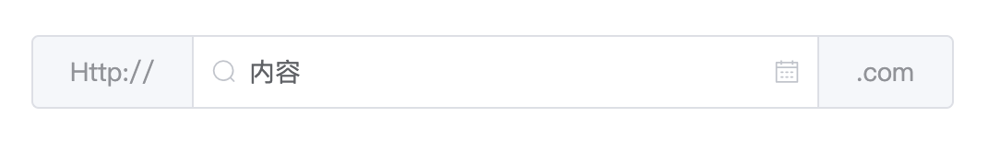
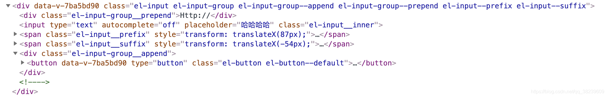

## ElementUI 源码分析 —— Input

### Input 输入框
分析一个组件，首先需要知道它的功能是什么？在哪里使用的？

input 的功能就是收集用户输入的数据传给后台程序，常见的有文本、密码、文本域（只考虑输入文字的）
一般会放在表单中，配合其他表单项一起使用
那么一开始，我们就需要了解一下它的基本结构：

### 基本结构
```html
<template>
  <div>
    <!-- 正常 input 输入框 -->
    <template>
      <!-- 前置元素，一般是放置标签或者下拉框 -->
      <div></div>
      <!-- 主体 input -->
      <input />
      <!-- 前置内容，一般是图标 -->
      <span></span>
      <!-- 后置内容，一般是图标 -->
      <span></span>
      <!-- 后置元素，如 .com 或者搜索按钮 -->
      <div></div>
    </template>
    
    <!-- 文本域 -->
    <textarea></textarea>
  </div>
</template>
```
在 input 框里分别对应下面图中的各个元素，可以看出在基本结构中，放元素的用div标签包裹，放置图标的用span包裹。


### 代码分析
接下来看具体代码：

<!-- 非多行文本框 -->
<template v-if="type !== 'textarea'">
  <!-- 前置元素 -->
  <!-- 如果传递了 prepend 插槽就显示，并把传进来的模板或者字符串渲染到 slot 中 -->
  <div class="el-input-group__prepend" v-if="$slots.prepend">
    <slot name="prepend"></slot>
  </div>
  <!-- input 属性稍后分析 -->
  <input />
  <!-- 前置内容 -->
  <!-- 支持通过 slot 和 prefi-icon 传值 -->
  <span class="el-input__prefix" v-if="$slots.prefix || prefixIcon">
    <!-- 当没有传递插槽时，这个是不会渲染的 -->
    <slot name="prefix"></slot>
    <i class="el-input__icon" v-if="prefixIcon" :class="prefixIcon"> </i>
  </span>
  <!-- 后置内容 -->
  <span class="el-input__suffix" v-if="getSuffixVisible()">
    <span class="el-input__suffix-inner">
      <!-- 该模板渲染的是后置图标 -->
      <template v-if="!showClear || !showPwdVisible || !isWordLimitVisible">
        <slot name="suffix"></slot>
        <i class="el-input__icon" v-if="suffixIcon" :class="suffixIcon">
        </i>
      </template>
      <!-- 清空按钮 -->
      <i
         v-if="showClear"
         class="el-input__icon el-icon-circle-close el-input__clear"
         @mousedown.prevent
         @click="clear"
         ></i>
      <!-- 显示密码按钮 -->
      <i
         v-if="showPwdVisible"
         class="el-input__icon el-icon-view el-input__clear"
         @click="handlePasswordVisible"
         ></i>
      <!-- 输入长度限制 -->
      <span v-if="isWordLimitVisible" class="el-input__count">
        <span class="el-input__count-inner">
          {{ textLength }}/{{ upperLimit }}
        </span>
      </span>
    </span>
    <i
       class="el-input__icon"
       v-if="validateState"
       :class="['el-input__validateIcon', validateIcon]"
       >
    </i>
  </span>
  <!-- 后置元素 -->
  <div class="el-input-group__append" v-if="$slots.append">
    <slot name="append"></slot>
  </div>
</template>


```js
// 首先是 getSuffixVisible 方法，用来判断后置内容是否显示，包括图标、清空按钮、显示密码按钮、输入长度限制字符。
getSuffixVisible () {
  return (
    this.$slots.suffix ||
    this.suffixIcon ||
    this.showClear ||
    this.showPassword ||
    this.isWordLimitVisible ||
    (this.validateState && this.needStatusIcon) // 这个主要和表单校验有关
  )
}
```

```js
// textLength 和 upperLimit，这两个都是计算属性，前者表示输入框输入的字符长度，后者是限制长度。

textLength () {
  // 如果是数字，先转换成字符串再求长度
  if (typeof this.value === 'number') {
    return String(this.value).length
  }
  return (this.value || '').length
},
upperLimit () {
  // 获取传递的原生属性 maxlength
  return this.$attrs.maxlength
}
```


关于vm.$attrs在 Vue 官网有介绍，这里解释一下，就是将父组件的属性（除去在 props 中传入的属性）传递给子组件。像 input 的原生属性特别多，如果所有的都通过子组件 props 来传递，代码会显得很冗余。

showClear 等这些计算属性考虑了很多种情况：

 * 是否传递了 clearable 
 * 是否被禁用了
 * 是否只读
 * 是否聚焦或者 hover 状态


### input 属性 
再回过头来分析 input

```js
  :tabindex="tabindex"
  v-if="type !== 'textarea'"
  class="el-input__inner"
  v-bind="$attrs"
  :type="showPassword ? (passwordVisible ? 'text' : 'password') : type"
  :disabled="inputDisabled"
  :readonly="readonly"
  :autocomplete="autoComplete || autocomplete"
  ref="input"
```

* tabindex表示使用 tab 键切换聚焦的顺序，有三个值：
    * -1，表示用 tab 键不能聚焦，但是可以使用 JS 获取
    * 0，表示可以通过 tab 键获取焦点
    * 正值，表示可以通过 tab 键获取焦点，切换的顺序是tabindex数值由小到大的顺序，如果多个元素相同，则是通过 DOM 中的顺序来决定的
* v-bind="$attrs"将父组件的非 props 属性传递给子组件 input
* type输入框类型，有 text 和 password
* disabled是否禁用
* readonly是否只读
* autocomplete是否打开输入框提示
* ref注册元素或子组件引用信息
    * 普通 DOM 元素上使用，引用指向的是 DOM 元素
    * 子组件上使用，引用指向这个子组件实例
    * 通过this.$refs.input可以访问到子组件

### input 事件

```js
  @compositionstart="handleCompositionStart"
  @compositionupdate="handleCompositionUpdate"
  @compositionend="handleCompositionEnd"
  @input="handleInput"
  @focus="handleFocus"
  @blur="handleBlur"
  @change="handleChange"
```

* compositionstart文字输入之前触发
* compositionupdate输入过程中每次敲击键盘触发
* compositionend选择字词完成时触发
注册这三个事件的原因在于实现中文输入法下，仅在选词后触发 input 事件。由于在输入拼音的时输入框不是立即获得输入的值，而是要确实后才能获取到。

触发**compositionstart**时，文本框会填入待确认文本，同时触发 input 事件；在触发compositionend时，就是填入已确认的文本,所以这里如果不想触发 input 事件的话就得设置一个变量来控制。

* ➡ MDN 关于 **compositionstart** 事件的介绍 
    * 文本合成系统如 input method editor（即输入法编辑器）开始新的输入合成时会触发 compositionstart 事件。 例如，当用户使用拼音输入法开始输入汉字时，这个事件就会被触发。

```js
  handleCompositionStart () {
    // 正在输入
    this.isComposing = true
  },
  handleCompositionUpdate (event) {
    // 获取敲击键盘的值
    const text = event.target.value
    // 获取最后一个输入的字符
    const lastCharacter = text[text.length - 1] || ''
    // 这个和韩文有关，暂时没搞清楚是啥意思
    this.isComposing = !isKorean(lastCharacter)
  },
  handleCompositionEnd (event) {
    // 如果输入结束并选择了字词，就触发 input 事件
    if (this.isComposing) {
      this.isComposing = false
      this.handleInput(event)
    }
  },
  handleInput (event) {
    // 如果正在输入就不触发 input 事件
    if (this.isComposing) return
    // 没懂这个 nativeInputValue 是啥意思 应该是输入值和原值相等就直接return
    if (event.target.value === this.nativeInputValue) return
    // 通知父组件触发 input 方法
    this.$emit('input', event.target.value)
    
    this.$nextTick(this.setNativeInputValue)
  }
```
关于 input 身上的东西总算没有了，textarea 和 input 区别不大，这里就不赘叙了，关于文本域的自适应高度后面会讲。

### 代码逻辑
现在将重点关注在script标签上，从源码可以看出有 300 多行代码都是关于 input 逻辑的。

头部**import**

```js
  import emitter from 'element-ui/src/mixins/emitter'
  import Migrating from 'element-ui/src/mixins/migrating'
  import calcTextareaHeight from './calcTextareaHeight'
  import merge from 'element-ui/src/utils/merge'
  import { isKorean } from 'element-ui/src/utils/shared'
```

这里面导入的都是一些混入和工具类函数，首先在src的mixins里面找到**emitter**，我们看一下它的源码

```js
  /**
   * 广播，就是父组件向后代组件广播事件
   * 通过不断递归子组件，触发所需组件的对应事件
   * @param {*} componentName 目标组件名称
   * @param {*} eventName 要触发的事件名
   * @param {*} params 参数
   */
  function broadcast (componentName, eventName, params) {
    // 遍历当前组件实例的所有子组件
    this.$children.forEach(child => {
      // 拿到子组件名称
      var name = child.$options.componentName
      // 如果当前子组件就是目标组件
      if (name === componentName) {
        // 通知子组件触发对应事件
        child.$emit.apply(child, [eventName].concat(params))
      } else {
        // 递归遍历深层子组件
        broadcast.apply(child, [componentName, eventName].concat([params]))
      }
    })
  }
  export default {
    methods: {
      // 派发，就是子组件向父组件派发事件
      dispatch (componentName, eventName, params) {
        // 获取当前组件的父组件
        var parent = this.$parent || this.$root
        // 拿到父组件名称
        var name = parent.$options.componentName
        // 通过循环的方式不断向父组件查找目标组件
        while (parent && (!name || name !== componentName)) {
          parent = parent.$parent
          if (parent) {
            name = parent.$options.componentName
          }
        }
        // 当循环结束，证明目标父组件已找到（如果存在），就通知父组件触发相应事件
        if (parent) {
          parent.$emit.apply(parent, [eventName].concat(params))
        }
      },
      broadcast (componentName, eventName, params) {
        // 把 this 指向调用它的组件实例身上
        broadcast.call(this, componentName, eventName, params)
      }
    }
  }
```
至于为什么要定义这样一个混入文件，我们可以通过它的调用来了解。
```js
  handleBlur (event) {
    this.focused = false
    this.$emit('blur', event)
    if (this.validateEvent) {
      this.dispatch('ElFormItem', 'el.form.blur', [this.value])
    }
  }
```

当 input 失去焦点时，通过官方的校验工具对输入框进行校验，这里就涉及到了深层次的父子组件通信，通过**dispatch**能够指定**ElFormItem**触发**el.form.blur**事件，而不必一层一层的向上传递。

所以定义**dispatch**和**broadcast**方法是为了解决有嵌套关系的父子通信问题，定向的向某个父或者子组件远程调用事件，这样就避免了通过传 props 或者使用 refs 调用组件实例方法的操作。

这里有必要提前说明一下混入，官网关于混入的介绍可自行查看，一句话概括就是组件公共的方法被提取出来，需要用到的时候就通过混入方式将方法或者生命周期函数添加到需要用到的组件中。

对于$broadcast和$dispatch详细参考了掘金的这篇文章(https://juejin.cn/post/6844903791553150989)，感谢作者，大家有兴趣可以去点个赞！

接下来看第二个混入**migrating**，直接上源码

```js
  export default {
    // 首先是混入生命周期函数 mounted，该函数会在组件自身 mounted 调用之前调用
    mounted () {
      // 如果是生产环境直接返回，因为在实际上线后是不建议使用 console 的
      if (process.env.NODE_ENV === 'production') return
      // 如果该组件不是一个虚拟 DOM 节点直接返回，因为你都渲染成真实 DOM 了还警告啥
      if (!this.$vnode) return
      // 解构赋值了解一下
      const { props = {}, events = {} } = this.getMigratingConfig()
      const { data, componentOptions } = this.$vnode
      // data 中的属性，不要问为什么是 attrs，自己去看抽象语法树
      const definedProps = data.attrs || {}
      // listeners 包含了组件的事件监听器
      const definedEvents = componentOptions.listeners || {}

      // for/in 循环遍历定义的属性
      for (let propName in definedProps) {
        // 把驼峰命名的属性改为以 - 连接的形式
        propName = kebabCase(propName)
        // 如果在 data 中定义了 props 中的属性，控制台会警告
        if (props[propName]) {
          console.warn(
            `[Element Migrating][${this.$options.name}][Attribute]: ${props[propName]}`
          )
        }
      }
      // 这个不解释了，头大
      for (let eventName in definedEvents) {
        eventName = kebabCase(eventName) // compatible with camel case
        if (events[eventName]) {
          console.warn(
            `[Element Migrating][${this.$options.name}][Event]: ${events[eventName]}`
          )
        }
      }
    },
    methods: {
      getMigratingConfig () {
        return {
          props: {},
          events: {}
        }
      }
    }
  }
```

在源码的注释上明确指出了该如何使用该混入，这里直接看在 input 组如何使用的。

```js
  getMigratingConfig () {
    return {
      props: {
        icon: 'icon is removed, use suffix-icon / prefix-icon instead.',
        'on-icon-click': 'on-icon-click is removed.'
      },
      events: {
        click: 'click is removed.'
      }
    }
  }
```

这个方法的作用就是：如果我们在el-input中添加一个icon属性，就会出现警告，并且icon属性没有生效，同样的，click事件也一样。

这里顺便提一下**kebabCase**方法，解释一下这个正则表达式，()表示的是正则里面的分组，整个正则表达式匹配的是第一组为不包含-（^放在[]里表示取反）和第二组包含大写字母的字符串。通过字符串替换方法，将目标字符串用$1-$2的格式替换，$1和$2代表的是正则表达式的分组，$1表示的是第一个小括号匹配到的内容，$2表示的是第二个小括号匹配到的字符串。最后将字符串全部转换成小写，这里有一点不明白的就是为什么使用两次replace方法，我试了很多个字符串，调用一次都能够得到正确的结果。

比如将suffixIcon当成参数传进去，得到的就是suffix-icon

```js
  /**
   * 将小驼峰命名的字符串转换成以 - 连接的字符串
   * @param {*} str 需要转换的字符串
   */
  export const kebabCase = function(str) {
    const hyphenateRE = /([^-])([A-Z])/g;
    return str
      .replace(hyphenateRE, '$1-$2')
      .replace(hyphenateRE, '$1-$2')
      .toLowerCase();
  };
```

有关 VNode 结构可以去 Vue 的源代码中查看，如果你想了解的更多可能要去看一下虚拟 DOM 的原理了，由于本渣还没有看，就不多讲了。

接下来就是**calcTextareaHeight**方法了，首先我们要知道为什么要定义这个方法？

在 ElementUI 官方文档上有指出通过设置**autosize**属性可以使得文本域的高度能够根据文本内容自动进行调整，并且autosize还可以设定为一个对象，指定最小行数和最大行数。

所以这个方法当然是用来动态计算文本域的高度的，再来看在哪里调用的：

```js
  resizeTextarea () {
    // 如果是运行在服务端则返回
    if (this.$isServer) return
    const { autosize, type } = this
    if (type !== 'textarea') return
    // 如果没有打开自适应高度默认就是单行文本的高度
    if (!autosize) {
      this.textareaCalcStyle = {
        minHeight: calcTextareaHeight(this.$refs.textarea).minHeight
      }
      return
    }
    const minRows = autosize.minRows
    const maxRows = autosize.maxRows

    // 当传入的是布尔值时，maxRows 就是 null，即没有最大高度限制
    // 传入对象时，就会出现最小高度和最大高度
    this.textareaCalcStyle = calcTextareaHeight(
      this.$refs.textarea,
      minRows,
      maxRows
    )
  }
```

**resizeTextarea**这个方法是用来改变文本域的大小的，初次渲染时会调用该方法，当我们改变输入框的值时会多次触发该方法。

```js
  // 先提前说明，该变量是为了计算 textarea 的高度而存在的
  // 至于为什么要定义一个这样的变量，看完后面就明白了
  let hiddenTextarea

  // 通过下面定义的样式起到隐藏效果
  const HIDDEN_STYLE = `
    height:0 !important;
    visibility:hidden !important;
    overflow:hidden !important;
    position:absolute !important;
    z-index:-1000 !important;
    top:0 !important;
    right:0 !important
  `

  const CONTEXT_STYLE = [
    'letter-spacing',
    'line-height',
    'padding-top',
    'padding-bottom',
    'font-family',
    'font-weight',
    'font-size',
    'text-rendering',
    'text-transform',
    'width',
    'text-indent',
    'padding-left',
    'padding-right',
    'border-width',
    'box-sizing'
  ]

  function calculateNodeStyling (targetElement) {
    // 拿到目标元素真实的 style 数据（计算后的）
    const style = window.getComputedStyle(targetElement)

    const boxSizing = style.getPropertyValue('box-sizing')

    const paddingSize =
      parseFloat(style.getPropertyValue('padding-bottom')) +
      parseFloat(style.getPropertyValue('padding-top'))

    const borderSize =
      parseFloat(style.getPropertyValue('border-bottom-width')) +
      parseFloat(style.getPropertyValue('border-top-width'))

    // 使它拥有目标元素所有的样式，并转换成以 ; 连接的字符串
    const contextStyle = CONTEXT_STYLE.map(
      name => `${name}:${style.getPropertyValue(name)}`
    ).join(';')

    return { contextStyle, paddingSize, borderSize, boxSizing }
  }

  /**
   * 动态计算 textarea 的高度
   * @param {*} targetElement 需要计算高度的目标元素
   * @param {*} minRows 最小行，默认 1
   * @param {*} maxRows 最大行，默认 null
   */
  export default function calcTextareaHeight (
    targetElement,
    minRows = 1,
    maxRows = null
  ) {
    // 如果 textarea 不存在就创建一个
    if (!hiddenTextarea) {
      hiddenTextarea = document.createElement('textarea')
      document.body.appendChild(hiddenTextarea)
    }

    // 与数组的解构赋值不同，对象的属性没有次序，变量必须与属性同名，才能取到正确的值
    let {
      paddingSize,
      borderSize,
      boxSizing,
      contextStyle
    } = calculateNodeStyling(targetElement)

    // 通过直接设置 style 属性，使之成为内联样式
    hiddenTextarea.setAttribute('style', `${contextStyle};${HIDDEN_STYLE}`)
    hiddenTextarea.value = targetElement.value || targetElement.placeholder || ''

    // scrollHeight 是一个元素内容高度，包括由于溢出导致的视图中不可见内容（包含 padding）
    let height = hiddenTextarea.scrollHeight
    const result = {}

    // 这里判断一下当前是 IE 盒模型还是标准盒模型
    // IE 盒模型高度包括了内容（包含 padding）和边框
    // 标准盒模型高度只是内容的高度，并且不包含 padding
    if (boxSizing === 'border-box') {
      height = height + borderSize
    } else if (boxSizing === 'content-box') {
      height = height - paddingSize
    }

    // 通过将 textarea 的值设为空字符串来计算单行文本内容所占的高度
    hiddenTextarea.value = ''
    let singleRowHeight = hiddenTextarea.scrollHeight - paddingSize

    if (minRows !== null) {
      let minHeight = singleRowHeight * minRows
      if (boxSizing === 'border-box') {
        minHeight = minHeight + paddingSize + borderSize
      }
      // 最小高度应该取两者最大的，你品，你仔细品！
      height = Math.max(minHeight, height)
      result.minHeight = `${minHeight}px`
    }
    if (maxRows !== null) {
      let maxHeight = singleRowHeight * maxRows
      if (boxSizing === 'border-box') {
        maxHeight = maxHeight + paddingSize + borderSize
      }
      // 最大高度应该取两者最小的
      height = Math.min(maxHeight, height)
    }
    result.height = `${height}px`
    // 在移除 hiddenTextarea 前需要先判断是否有父节点，如果不判断，没有父节点时会报错
    // && 前面的如果为假就不会继续执行后面的表达式
    // 一般我想到的是使用 if 来判断，使用 && 这种写法可以使代码很优雅，学习了！
    hiddenTextarea.parentNode &&
      hiddenTextarea.parentNode.removeChild(hiddenTextarea)
    // 一定要释放变量，否则一直在内存中存在，消耗内存
    hiddenTextarea = null
    return result
  }
```

最后看一下导入的**merge.js**这个文件，这个文件主要导出了一个函数，主要作用是合并两个对象为一个对象，相当于 ES6 的Object.assign()方法，只不过这里为了兼容浏览器，而使用 ES5 的方式实现了。

赶紧记下来吧，说不定面试就会让你手写一个Object.assign()方法，有关该方法的可以看阮老师的 ES6

```js
  /**
   * 合并对象的属性，相当于 ES6 的 Object.assign()
   * 是浅拷贝，注意引用类型
   * @param {*} target 目标对象
   */
  export default function (target) {
    // 从第二个实参开始遍历
    for (let i = 1, j = arguments.length; i < j; i++) {
      // 把拿到的实参当作源对象
      let source = arguments[i] || {}
      // 遍历源对象身上的属性
      for (let prop in source) {
        // 必须保证是源对象自身的属性
        if (source.hasOwnProperty(prop)) {
          // 如果这个属性值不是 undefined 就把它添加到目标对象中
          // 注意，同名属性会覆盖
          let value = source[prop]
          if (value !== undefined) {
            target[prop] = value
          }
        }
      }
    }
    return target
  }
```

* MDN 上关于 scrollHeight 的解释，不懂的小伙伴赶紧补习一下，面试的时候还会问你和clientHeight、offsetHeight有什么区别。
    * Element.scrollHeight 这个只读属性是一个元素内容高度的度量，包括由于溢出导致的视图中不可见内容。
    * clientHeight 元素的像素高度,包含元素的高度+内边距,不包含水平滚动条,边框和外边距
    * offsetHeight 元素的像素高度 包含元素的垂直内边距和边框,水平滚动条的高度,且是一个整数
    * offsetLeft 返回元素左上角相对于offsetParent的左边界的偏移像素值

到现在为止，input 组件主体内容已经分析的差不多了，接下来就是一些零零散散的内容了，一个个往下看。

```js
  inheritAttrs: false
```

这是 Vue2.4.0 新增的，那么为什么要使用它呢？因为组件内未被注册的属性将作为普通 HTML 元素属性被渲染，如果想让属性能够向下传递，即使 prop 组件没有被使用，你也需要在组件上注册，这样做会使组件预期功能变得模糊不清。

如果在组件中添加了inheritAttrs: false，那么组件将不会把未被注册的 props 呈现为普通的 HTML 属性。但是在组件里我们可以通过其$attrs可以获取到没有使用的注册属性。

### 依赖注入
当我们的组件嵌套很深时，我们就不推荐使用this.$parent来访问我们的父组件，因为嵌套很深时很难判断this.$parent到底指向的是那个父组件，所以需要使用到「依赖注入」

看一看源码中的依赖注入

```js
  inject: {
    elForm: {
      default: ''
    },
    elFormItem: {
      default: ''
    }
  }
```

也就是说这里将el-form的相关数据注入了进来，因为 input 组件一般是伴随着 Form 表单出现，当 input 事件被触发时，需要通知其父组件的触发相关事件。

有关依赖注入的详细解释可以看 Vue 官方文档(https://cn.vuejs.org/api/composition-api-dependency-injection.html#composition-api-brdependency-injection)

### 监听属性
再来看一下 watch 里面都做了什么（坚持一下，就快完了！！！）

要了解 watch 的作用，我们就得先知道为什么要使用 watch，不是说能用计算属性尽量使用计算属性吗，怎么又使用了 watch （小问号，你是否有很多朋友？）

watch 是 Vue 里面提供的监听器，用来监听响应式数据的变化，当 data 中的数据发生了变化时，就会触发 watch 中的同名函数，在 watch 中可以执行任何逻辑，并且产生的数据不会缓存，这也就是说为什么 Vue 建议我们在 computed 中使用「复杂的计算逻辑」，而在 watch 中尽量执行一些「异步或者开销大的操作」。

既然知道了为什么要使用 watch，那我们就来看一下 input 中的 watch。给爷上代码：

```js
  watch: {
    // 监听 value 的变化
    value (val) {
      // 当 value 变化了需要重新改变文本域的大小
      // 这个属于 DOM 操作，所以放在 $nextTick() 中
      this.$nextTick(this.resizeTextarea)
      // 如果需要校验，那就要通知父组件触发 change 方法
      if (this.validateEvent) {
        this.dispatch('ElFormItem', 'el.form.change', [val])
      }
    },
    // 监听 type 的变化，type 为 input 或者 textarea
    type () {
      // 同样当 type 变化时，DOM 也会发生改变
      this.$nextTick(() => {
        this.setNativeInputValue()
        this.resizeTextarea()
        this.updateIconOffset()
      })
    }
  }
```

需要说一下的就是**this.$nextTick(callback)**，它在 DOM 更新后执行回调函数以获取最新的 DOM，也就是说我们可以在「回调函数里执行 DOM 操作」

那什么时候使用$nextTick呢，目前我所知道有两种：

生命周期created()函数中进行的 DOM 操作一定要放在$nextTick()中，因为created()函数执行时 页面中 DOM 节点还没有渲染，拿不到 DOM 节点
当你的数据更新之后，需要手动操作 DOM 元素时，可以讲逻辑写在回调函数里
那既然知道为什么使用了，也就能看懂上面的解释了。

移步官网查看异步更新队列(https://cn.vuejs.org/v2/guide/reactivity.html#%E5%BC%82%E6%AD%A5%E6%9B%B4%E6%96%B0%E9%98%9F%E5%88%97)

所以综上来看，input 中的 watch 主要是用于 input 值或者类型发生变化时需要更新 DOM。

还有一个小小的函数是**calcIconOffset()**，这个函数主要是和小图标的样式相关（关于样式的部分后续再分析吧，真的搞不动了），用于计算横向偏移量。看下源码：

```js
  // 计算图标的横向偏移量
  calcIconOffset (place) {
    // 找到 class 为 .el-input__suffix 和 .el-input__prefix 的元素
    // 并把他们转换为数组
    let elList = [].slice.call(
      this.$el.querySelectorAll(`.el-input__${place}`) || []
    )
    if (!elList.length) return
    let el = null
    // 通过循环判断 .el-input__suffix/prefix 是否是 input 的直接子元素
    for (let i = 0; i < elList.length; i++) {
      // $el 表示当前组件的根元素
      // $root 表示组件树的根元素
      // 如果本次循环的 DOM 元素的父元素就是当前实例的根元素，把它赋给 el
      if (elList[i].parentNode === this.$el) {
        el = elList[i]
        break
      }
    }
    if (!el) return
    // 此时 el 应该是 .el-input__suffix/prefix 元素
    // 定义前缀后缀
    const pendantMap = {
      suffix: 'append',
      prefix: 'prepend'
    }

    const pendant = pendantMap[place]
    // pendant: append/prepend
    // 如果在组件中添加了前置或后置元素
    if (this.$slots[pendant]) {
      // 设置 .el-input__suffix/prefix 元素的行内样式
      // 如果是后置元素，那平移的距离就是负的（向左）
      // 平移的距离就是前置或后置元素的宽度
      el.style.transform = `translateX(${place === 'suffix' ? '-' : ''}${
      this.$el.querySelector(`.el-input-group__${pendant}`).offsetWidth
    }px)`
    } else {
      el.removeAttribute('style')
    }
  }
```

不得不说他们对于样式的计算非常精准，考虑了很多复杂的方面，放一张结构图让大家好理解一点



照着这个结构再去看calcIconOffset()方法就会容易很多，该有的都有了我也不想解释了（心累啊！！）。

到目前为止，input 组件的所有内容基本上全写完了，关于官方文档上的autocomplete这个组件我准备后期再看，留到后面去分析。

### 总结与梳理
现在让我们把脑子放空，闭上眼睛，仔细去想一想 input 组件到底做了哪些事？从我们移动鼠标到输入框上开始，到最后输入完成移开鼠标，这中间的数据是怎么流动的？过程中触发了哪些事件？这样一想你会从整体上理解input 组件。

到目前为止这是我看的第二个组件，第一个是 button，至于为什么不写 button，实在是因为 button 里面的东西太少了，主要还是和样式有关，但是对于你初看源码的话还是建议先看一下 button，先了解一下组件思想以及他们是如何封装的，考虑了哪些情况，然后自己再试着手写一个 button 组件，这样你会对组件有更深的理解，对后面阅读源码也会有很大的帮助。