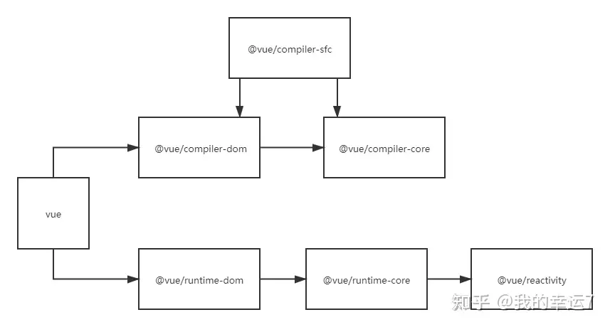

### Vue2

学习 vue.js 的源码，首先要学习源码目录，vue.js 的源码都在 src 目录下，目录结构如下：

```js
// src
// ├── compiler        # 编译相关
// ├── core            # 核心代码
// ├── platforms       # 不同平台的支持
// ├── server          # 服务端渲染
// ├── sfc             # .vue 文件解析
// ├── shared          # 共享代码
```

1. compiler
compiler 目录中主要存放编译相关的代码，比如说我们 vue 中定义的 template 的语法，浏览器是不识别的，所以在运行我们所写的代码前，需要将 template 模版中的语法解析成为浏览器可识别的代码。而这个过程就叫做编译。

2. core
这里主要放置 vue.js 的核心代码，包括内置组件、全局 API、实例化、观察者、工具函数、虚拟 dom 等相关代码。结构如下图所示：

```js
// core
// ├── components      # 内置组件相关
// ├── global-api      # 全局组件相关
// ├── instance        # 实例化相关
// ├── observer        # 观察者相关
// ├── util            # 工具函数
// ├── vdom            # 虚拟dom
```

这里的代码是 vue 的核心，包括响应式原理、观察者模式、虚拟 dom 等你能听到的 vue 核心理念 基本都囊括在里面。

3. platform
vue.js 是一个跨平台的框架，可以跑在 web 上，也可以配合 weex 跑在 native 客户端上，platform 是 Vue.js 的入口，2 个目录代表 2 个主要入口，分别打包成运行在 web 上和 weex 上的 Vue.js。

```js
// platform
// ├── web             # web端
// ├── weex            # weex端
```

我主要做 web 端开发，重点关注 web 端渲染，也就是 web 菜单，vue 实例化的入口文件也是在这个目录下。

4. server
Vue.js 支持服务端渲染，所有服务端渲染相关的逻辑都在这个目录下。注意：这部分代码是跑在服务端的 Node.js。

服务端渲染主要的工作是把组件渲染为服务器端的 HTML 字符串，将它们直接发送到浏览器，最后将静态标记"混合"为客户端上完全交互的应用程序。

做服务端渲染的话需要多多关注这里面的代码。

5. sfc
通常我们开发 Vue.js 都会借助 webpack 构建， 然后通过。vue 单文件来编写组件。
这个目录下的代码逻辑会把。vue 文件内容解析成一个 JavaScript 的对象。

想了解。vue 文件是如何解析的，需要好好分析这里面的代码。

6. shared
Vue.js 会定义一些工具方法，这里所定义的工具方法与 core 中有所不同，是会被浏览器端和服务端所共享的。

```js
// shared
// ├── constant.js     # 定义了一些全局需要用到的常量
// ├── util.js         # 共用的一些工具方法
```

```js
// // 从 vue 源码中找到缩写函数的含义
// function installRenderHelpers (target) {
//     target._o = markOnce;
//     target._n = toNumber;
//     target._s = toString;
//     target._l = renderList;
//     target._t = renderSlot;
//     target._q = looseEqual;
//     target._i = looseIndexOf;
//     target._m = renderStatic;
//     target._f = resolveFilter;
//     target._k = checkKeyCodes;
//     target._b = bindObjectProps;
//     target._v = createTextVNode;
//     target._e = createEmptyVNode;
//     target._u = resolveScopedSlots;
//     target._g = bindObjectListeners;
//     target._d = bindDynamicKeys;
//     target._p = prependModifier;
// }
```

├── scripts ------------------------------- 构建相关的文件
│   ├── git-hooks ------------------------- git 钩子的目录
│   ├── alias.js -------------------------- 别名配置
│   ├── config.js ------------------------- rollup 配置文件
│   ├── build.js -------------------------- 对 config.js 中所有的 rollup 配置进行构建
│   ├── ci.sh ----------------------------- 持续集成运行的脚本
│   ├── release.sh ------------------------ 用于自动发布新版本的脚本
├── dist ---------------------------------- 构建后文件的输出目录
├── examples ------------------------------ 存放一些使用 Vue 开发的应用案例
├── flow ---------------------------------- 类型声明，使用开源项目 [Flow](https://flowtype.org/)
├── packages ------------------------------ 存放独立发布的包的目录
├── test ---------------------------------- 包含所有测试文件
├── src ----------------------------------- 源码
│   ├── compiler -------------------------- 编译器代码的存放目录将 template 编译为 render 函数
│   ├── core ------------------------------ 存放通用的，与平台无关的代码
│   │   ├── observer ---------------------- 响应系统，包含数据观测的核心代码
│   │   ├── vdom -------------------------- 虚拟 DOM 创建 (creation) 和打补丁 (patching) 的代码
│   │   ├── instance ---------------------- Vue 构造函数设计相关的代码
│   │   ├── global-api -------------------- Vue 构造函数挂载全局方法（静态方法）或属性的代码
│   │   ├── components -------------------- 抽象出来的通用组件
│   ├── server ---------------------------- 服务端渲染 (server-side rendering) 的相关代码
│   ├── platforms ------------------------- 平台特相关代码，不同平台的不同构建的入口文件存放地
│   │   ├── web --------------------------- web 平台
│   │   │   ├── entry-runtime.js ---------- 运行时构建的入口，不包含模板 (template) 到 render 函数的编译器。
│   │   │   ├── entry-runtime-with-compiler.js -- 独立构建版本的入口，在 entry-runtime 的基础上添加了模板 (template) 到 render 函数的编译器
│   │   │   ├── entry-compiler.js --------- vue-template-compiler 包的入口文件
│   │   │   ├── entry-server-renderer.js -- vue-server-renderer 包的入口文件
│   │   │   ├── entry-server-basic-renderer.js -- 输出 packages/vue-server-renderer/basic.js 文件
│   │   ├── weex -------------------------- 混合应用
│   ├── sfc ------------------------------- 包含单文件组件 (.vue 文件）的解析逻辑，用于 vue-template-compiler 包
│   ├── shared ---------------------------- 包含整个代码库通用的代码
├── package.json --------------------------  你懂得
├── yarn.lock ----------------------------- yarn 锁定文件
├── .editorconfig ------------------------- 针对编辑器的编码风格配置文件
├── .flowconfig --------------------------- flow 的配置文件
├── .babelrc ------------------------------ babel 配置文件
├── .eslintrc ----------------------------- eslint 配置文件
├── .eslintignore ------------------------- eslint 忽略配置
├── .gitignore ---------------------------- git 忽略配置

### Vue3

```js
// Vue3 的项目结构
// reactivity: 响应式系统
// runtime-core: 与平台无关的运行时核心 （可以创建针对特定平台的运行时 - 自定义渲染器）
// runtime-dom: 针对浏览器的运行时。包括 DOM API，属性，事件处理等
// runtime-test: 用于测试
// server-renderer: 用于服务器端渲染
// compiler-core: 与平台无关的编译器核心
// compiler-dom: 针对浏览器的编译模块
// compiler-ssr: 针对服务端渲染的编译模块
// compiler-sfc: 针对单文件解析
// size-check: 用来测试代码体积
// template-explorer：用于调试编译器输出的开发工具
// shared：多个包之间共享的内容
// vue: 完整版本，包括运行时和编译器
```


