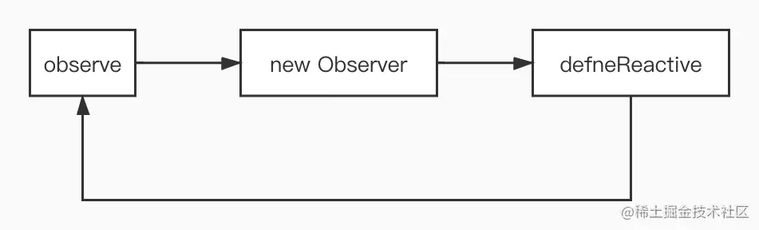
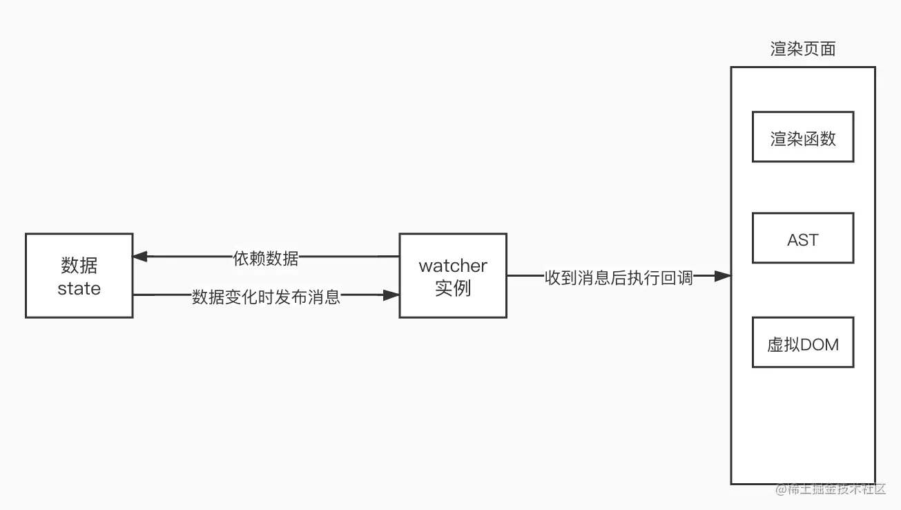

## 前言

数据模型仅仅是普通的 JavaScript 对象。而当你修改它们时，视图会进行更新。

使用 Vue 时，我们只需要修改数据 (state)，视图就能够获得相应的更新，这就是响应式系统。要实现一个自己的响应式系统，我们首先要明白要做什么事情：

数据劫持：当数据变化时，我们可以做一些特定的事情
依赖收集：我们要知道那些视图层的内容 (DOM) 依赖了哪些数据 (state)
派发更新：数据变化后，如何通知依赖这些数据的 DOM
接下来，我们将一步步地实现一个自己的玩具响应式系统

## 数据劫持

几乎所有的文章和教程，在讲解 Vue 响应式系统时都会先讲：Vue 使用 Object.defineProperty 来进行数据劫持。那么，我们也从数据劫持讲起，大家可能会对劫持这个概念有些迷茫，没有关系，看完下面的内容，你一定会明白。
Object.defineProperty 的用法在此不多做介绍，不明白的同学可在 MDN 上查阅。下面，我们为 obj 定义一个 a 属性

```js
const obj = {}

let val = 1
Object.defineProperty(obj, a, {
  get() { // 下文中该方法统称为getter
    console.log('get property a')
    return val
  },
  set(newVal) { // 下文中该方法统称为setter
    if (val === newVal) return
    console.log(`set property a -> ${newVal}`)
    val = newVal
  }
})
```

这样，当我们访问 obj.a 时，打印 get property a 并返回 1，obj.a = 2 设置新的值时，打印 set property a -> 2。这相当于我们自定义了 obj.a 取值和赋值的行为，使用自定义的 getter 和 setter 来重写了原有的行为，这也就是数据劫持的含义。
但是上面的代码有一个问题：我们需要一个全局的变量来保存这个属性的值，因此，我们可以用下面的写法

```js
// value使用了参数默认值
function defineReactive(data, key, value = data[key]) {
  Object.defineProperty(data, key, {
    get: function reactiveGetter() {
      return value
    },
    set: function reactiveSetter(newValue) {
      if (newValue === value) return
      value = newValue
    }
  })
}

defineReactive(obj, a, 1)
```

如果 obj 有多个属性呢？我们可以新建一个类 Observer 来遍历该对象

```js
class Observer {
  constructor(value) {
    this.value = value
    this.walk()
  }
  walk() {
    Object.keys(this.value).forEach((key) => defineReactive(this.value, key))
  }
}

const obj = { a: 1, b: 2 }
new Observer(obj)
```

如果 obj 内有嵌套的属性呢？我们可以使用递归来完成嵌套属性的数据劫持

```js
// 入口函数
function observe(data) {
  if (typeof data !== 'object') return
  // 调用Observer
  new Observer(data)
}

class Observer {
  constructor(value) {
    this.value = value
    this.walk()
  }
  walk() {
    // 遍历该对象，并进行数据劫持
    Object.keys(this.value).forEach((key) => defineReactive(this.value, key))
  }
}

function defineReactive(data, key, value = data[key]) {
  // 如果value是对象，递归调用observe来监测该对象
  // 如果value不是对象，observe函数会直接返回
  observe(value)
  Object.defineProperty(data, key, {
    get: function reactiveGetter() {
      return value
    },
    set: function reactiveSetter(newValue) {
      if (newValue === value) return
      value = newValue
      observe(newValue) // 设置的新值也要被监听
    }
  })
}

const obj = {
  a: 1,
  b: {
    c: 2
  }
}

observe(obj)
```

对于这一部分，大家可能有点晕，接下来梳理一下：

```js
执行observe(obj)
├── new Observer(obj),并执行this.walk()遍历obj的属性，执行defineReactive()
    ├── defineReactive(obj, a)
        ├── 执行observe(obj.a) 发现obj.a不是对象，直接返回
        ├── 执行defineReactive(obj, a) 的剩余代码
    ├── defineReactive(obj, b)
	    ├── 执行observe(obj.b) 发现obj.b是对象
	        ├── 执行 new Observer(obj.b)，遍历obj.b的属性，执行defineReactive()
                    ├── 执行defineReactive(obj.b, c)
                        ├── 执行observe(obj.b.c) 发现obj.b.c不是对象，直接返回
                        ├── 执行defineReactive(obj.b, c)的剩余代码
            ├── 执行defineReactive(obj, b)的剩余代码
代码执行结束
```

可以看出，上面三个函数的调用关系如下：


三个函数相互调用从而形成了递归，与普通的递归有所不同。
有些同学可能会想，只要在 setter 中调用一下渲染函数来重新渲染页面，不就能完成在数据变化时更新页面了吗？确实可以，但是这样做的代价就是：任何一个数据的变化，都会导致这个页面的重新渲染，代价未免太大了吧。我们想做的效果是：数据变化时，只更新与这个数据有关的 DOM 结构，那就涉及到下文的内容了：依赖

## 收集依赖与派发更新

### 依赖

在正式讲解依赖收集之前，我们先看看什么是依赖。举一个生活中的例子：淘宝购物。现在淘宝某店铺上有一块显卡（空气）处于预售阶段，如果我们想买的话，我们可以点击预售提醒，当显卡开始卖的时候，淘宝为我们推送一条消息，我们看到消息后，可以开始购买。
将这个例子抽象一下就是发布 - 订阅模式：买家点击预售提醒，就相当于在淘宝上登记了自己的信息（订阅），淘宝则会将买家的信息保存在一个数据结构中（比如数组）。显卡正式开放购买时，淘宝会通知所有的买家：显卡开卖了（发布），买家会根据这个消息进行一些动作（比如买回来挖矿）。
在 Vue 响应式系统中，显卡对应数据，那么例子中的买家对应什么呢？就是一个抽象的类：Watcher。大家不必纠结这个名字的含义，只需要知道它做什么事情：每个 Watcher 实例订阅一个或者多个数据，这些数据也被称为 wacther 的依赖（商品就是买家的依赖）；当依赖发生变化，Watcher 实例会接收到数据发生变化这条消息，之后会执行一个回调函数来实现某些功能，比如更新页面（买家进行一些动作）。



因此 Watcher 类可以如下实现

```js
class Watcher {
  constructor(data, expression, cb) {
    // data: 数据对象，如obj
    // expression：表达式，如b.c，根据data和expression就可以获取watcher依赖的数据
    // cb：依赖变化时触发的回调
    this.data = data
    this.expression = expression
    this.cb = cb
    // 初始化watcher实例时订阅数据
    this.value = this.get()
  }

  get() {
    const value = parsePath(this.data, this.expression)
    return value
  }

  // 当收到数据变化的消息时执行该方法，从而调用cb
  update() {
    this.value = parsePath(this.data, this.expression) // 对存储的数据进行更新
    cb()
  }
}

function parsePath(obj, expression) {
  const segments = expression.split('.')
  for (let key of segments) {
    if (!obj) return
    obj = obj[key]
  }
  return obj
}
```

如果你对 Watcher 这个类什么时候实例化有疑问的话，没关系，下面马上就会讲到

其实前文例子中还有一个点我们尚未提到：显卡例子中说到，淘宝会将买家信息保存在一个数组中，那么我们的响应式系统中也应该有一个数组来保存买家信息，也就是 watcher。
总结一下我们需要实现的功能：

```js
1. 有一个数组来存储 watcher // defineReactive
2. watcher 实例需要订阅（依赖）数据，也就是获取依赖或者收集依赖 // defineReactive中的 数据中的dep收集watcher
3. watcher 的依赖发生变化时触发 watcher 的回调函数，也就是派发更新。// defineReactive
```

每个数据都应该维护一个属于自己的数组，该数组来存放依赖自己的 watcher，我们可以在 defineReactive 中定义一个数组 dep，这样通过闭包，每个属性就能拥有一个属于自己的 dep

```js
function defineReactive(data, key, value = data[key]) {
  const dep = [] // 增加
  observe(value)
  Object.defineProperty(data, key, {
    get: function reactiveGetter() {
      return value
    },
    set: function reactiveSetter(newValue) {
      if (newValue === value) return
      value = newValue
      observe(newValue)
      dep.notify() // 后面把dep抽象成了对象
    }
  })
}

到这里，我们实现了第一个功能，接下来实现收集依赖的过程。
```

### 依赖收集

现在我们把目光集中到页面的初次渲染过程中（暂时忽略渲染函数和虚拟 DOM 等部分）：渲染引擎会解析模板，比如引擎遇到了一个插值表达式，如果我们此时实例化一个 watcher，会发生什么事情呢？从 Watcher 的代码中可以看到，实例化时会执行 get 方法，get 方法的作用就是获取自己依赖的数据，而我们重写了数据的访问行为，为每个数据定义了 getter，因此 getter 函数就会执行，如果我们在 getter 中把当前的 watcher 添加到 dep 数组中（淘宝低登记买家信息），不就能够完成依赖收集了吗！！

```js
注意：执行到 getter 时，new Watcher() 的 get 方法还没有执行完毕。
new Watcher() 时执行 constructor，调用了实例的 get 方法，实例的 get 方法会读取数据的值，从而触发了数据的 getter，getter 执行完毕后，实例的 get 方法执行完毕，并返回值，constructor 执行完毕，实例化完毕。
```

```js
有些同学可能会有疑惑：明明是 watcher 收集依赖，应该是 watcher 收集数据，怎么成了数据的 dep 收集 watcher 了呢？有此疑问的同学可以再看一下前面淘宝的例子（是淘宝记录了用户信息），或者深入了解一下发布 - 订阅模式。
```

通过上面的分析，我们只需要对 getter 进行一些修改：

```js
get: function reactiveGetter() {
  dep.push(watcher) // 新增
  return value
}
```

问题又来了，watcher 这个变量从哪里来呢？我们是在模板编译函数中的实例化 watcher 的，getter 中取不到这个实例啊。解决方法也很简单，将 watcher 实例放到全局不就行了吗，比如放到 window.target 上。因此，Watcher 的 get 方法做如下修改

```js
get() {
  window.target = this // 新增
  const value = parsePath(this.data, this.expression)
  return value
}
```

这样，将 get 方法中的 dep.push(watcher) 修改为 dep.push(window.target) 即可。

```js
注意，不能这样写 window.target = new Watcher()。因为执行到 getter 的时候，实例化 watcher 还没有完成，所以 window.target 还是 undefined
```

```js
依赖收集过程：渲染页面时碰到插值表达式，v-bind 等需要数据等地方，会实例化一个 watcher, 实例化 watcher 就会对依赖的数据求值，从而触发 getter，数据的 getter 函数就会添加依赖自己的 watcher，从而完成依赖收集。***我们可以理解为 watcher 在收集依赖，而代码的实现方式是在数据中存储依赖自己的 watcher***
```

```js
细心的读者可能会发现，利用这种方法，每遇到一个插值表达式就会新建一个 watcher，这样每个节点就会对应一个 watcher。实际上这是 vue1.x 的做法，以节点为单位进行更新，粒度较细。而 vue2.x 的做法是每个组件对应一个 watcher，实例化 watcher 时传入的也不再是一个 expression，而是渲染函数，渲染函数由组件的模板转化而来，这样一个组件的 watcher 就能收集到自己的所有依赖，以组件为单位进行更新，是一种中等粒度的方式。要实现 vue2.x 的响应式系统涉及到很多其他的东西，比如组件化，虚拟 DOM 等，而这个系列文章只专注于数据响应式的原理，因此不能实现 vue2.x，但是两者关于响应式的方面，原理相同。
```

### 派发更新

实现依赖收集后，我们最后要实现的功能是派发更新，也就是依赖变化时触发 watcher 的回调。从依赖收集部分我们知道，获取哪个数据，也就是说触发哪个数据的 getter，就说明 watcher 依赖哪个数据，那数据变化的时候如何通知 watcher 呢？相信很多同学都已经猜到了：在 setter 中派发更新。

```js
set: function reactiveSetter(newValue) {
  if (newValue === value) return
  value = newValue
  observe(newValue)
  dep.forEach(d => d.update()) // 新增 update方法见Watcher类
}
```

## 优化代码

### Dep 类

我们可以将 dep 数组抽象为一个类：

```js
class Dep {
  constructor() {
    this.subs = []
  }

  depend() {
    this.addSub(Dep.target)
  }

  notify() {
    const subs = [...this.subs]
    subs.forEach((s) => s.update())
  }

  addSub(sub) {
    this.subs.push(sub)
  }
}
```

defineReactive 函数只需做相应的修改

```js
function defineReactive(data, key, value = data[key]) {
  const dep = new Dep() // 修改
  observe(value)
  Object.defineProperty(data, key, {
    get: function reactiveGetter() {
      dep.depend() // 修改
      return value
    },
    set: function reactiveSetter(newValue) {
      if (newValue === value) return
      value = newValue
      observe(newValue)
      dep.notify() // 修改
    }
  })
}
```

### window.target

在 watcher 的 get 方法中

```js
get() {
  window.target = this // 设置了window.target
  const value = parsePath(this.data, this.expression)
  return value
}
```

大家可能注意到了，我们没有重置 window.target。有些同学可能认为这没什么问题，但是考虑如下场景：有一个对象 obj: { a: 1, b: 2 }我们先实例化了一个 watcher1，watcher1 依赖 obj.a，那么 window.target 就是 watcher1。之后我们访问了 obj.b，会发生什么呢？访问 obj.b 会触发 obj.b 的 getter，getter 会调用 dep.depend()，那么 obj.b 的 dep 就会收集 window.target， 也就是 watcher1，这就导致 watcher1 依赖了 obj.b，但事实并非如此。为解决这个问题，我们做如下修改：

```js
// Watcher的get方法
get() {
  window.target = this
  const value = parsePath(this.data, this.expression)
  window.target = null // 新增，求值完毕后重置window.target
  return value
}

// Dep的depend方法
depend() {
  // 此外，Vue中使用Dep.target而不是window.target来保存当前的watcher，这一点影响不大，只要能保证有一个全局唯一的变量来保存当前的watcher即可
  if (Dep.target) { // 新增 Dep就相当于window，自定义了一个属性 
    this.addSub(Dep.target)
  }
}
```

通过上面的分析能够看出，window.target 的含义就是当前执行上下文中的 watcher 实例。由于 js 单线程的特性，同一时刻只有一个 watcher 的代码在执行，因此 window.target 就是当前正在处于实例化过程中的 watcher

### update 方法

我们之前实现的 update 方法如下：

```js
update() {
  this.value = parsePath(this.data, this.expression)
  this.cb()
}
```

大家回顾一下 vm.$watch 方法，我们可以在定义的回调中访问 this，并且该回调可以接收到监听数据的新值和旧值，因此做如下修改

```js
update() {
  const oldValue = this.value
  this.value = parsePath(this.data, this.expression)
  this.cb.call(this.data, this.value, oldValue)
}
```

### 学习一下 Vue 源码

在 Vue 源码 --56 行中，我们会看到这样一个变量：targetStack，看起来好像和我们的 window.target 有点关系，没错，确实有关系。设想一个这样的场景：我们有两个嵌套的父子组件，渲染父组件时会新建一个父组件的 watcher，渲染过程中发现还有子组件，就会开始渲染子组件，也会新建一个子组件的 watcher。在我们的实现中，新建父组件 watcher 时，window.target 会指向父组件 watcher，之后新建子组件 watcher，window.target 将被子组件 watcher 覆盖，子组件渲染完毕，回到父组件 watcher 时，window.target 变成了 null，这就会出现问题，因此，我们用一个栈结构来保存 watcher。

```js
const targetStack = []

function pushTarget(_target) {
  targetStack.push(window.target)
  window.target = _target
}

function popTarget() {
  window.target = targetStack.pop()
}
```

Watcher 的 get 方法做如下修改

```js
get() {
  pushTarget(this) // 修改
  const value = parsePath(this.data, this.expression)
  popTarget() // 修改
  return value
}
```

此外，Vue 中使用 Dep.target 而不是 window.target 来保存当前的 watcher，这一点影响不大，只要能保证有一个全局唯一的变量来保存当前的 watcher 即可

### 总结代码

现将代码总结如下：

```js
// 调用该方法来检测数据
function observe(data) {
  if (typeof data !== 'object') return
  new Observer(data)
}

class Observer {
  constructor(value) {
    this.value = value
    this.walk()
  }
  walk() {
    Object.keys(this.value).forEach((key) => defineReactive(this.value, key))
  }
}

// 数据拦截
function defineReactive(data, key, value = data[key]) {
  const dep = new Dep()
  observe(value)
  Object.defineProperty(data, key, {
    get: function reactiveGetter() {
      dep.depend()
      return value
    },
    set: function reactiveSetter(newValue) {
      if (newValue === value) return
      value = newValue
      observe(newValue)
      dep.notify()
    }
  })
}

// 依赖
class Dep {
  constructor() {
    this.subs = []
  }

  depend() {
    if (Dep.target) {
      this.addSub(Dep.target)
    }
  }

  notify() {
    const subs = [...this.subs]
    subs.forEach((s) => s.update())
  }

  addSub(sub) {
    this.subs.push(sub)
  }
}

Dep.target = null

const TargetStack = []

function pushTarget(_target) {
  TargetStack.push(Dep.target)
  Dep.target = _target
}

function popTarget() {
  Dep.target = TargetStack.pop()
}

// watcher
class Watcher {
  constructor(data, expression, cb) {
    this.data = data
    this.expression = expression
    this.cb = cb
    this.value = this.get()
  }

  get() {
    pushTarget(this)
    const value = parsePath(this.data, this.expression)
    popTarget()
    return value
  }

  update() {
    const oldValue = this.value
    // watcher中的get其实不光要在初始化时调用，在update时也应该调用，因为如果原本一个属性是一个对象，然后修改成了另一个对象，如果update中不使用get函数，那么这个新的对象中的属性将是没有被watcher所依赖的
    this.value = this.get() 
    this.cb.call(this.data, this.value, oldValue)
  }
}

// 工具函数
function parsePath(obj, expression) {
  const segments = expression.split('.')
  for (let key of segments) {
    if (!obj) return
    obj = obj[key]
  }
  return obj
}

// for test
let obj = {
  a: 1,
  b: {
    m: {
      n: 4
    }
  }
}

observe(obj)

let w1 = new Watcher(obj, 'a', (val, oldVal) => {
  console.log(`obj.a 从 ${oldVal}(oldVal) 变成了 ${val}(newVal)`)
})

```

## 注意事项

### 闭包

Vue 能够实现如此强大的功能，离不开闭包的功劳：在 defineReactive 中就形成了闭包，这样每个对象的每个属性就能保存自己的值 value 和依赖对象 dep。

### 只要触发 getter 就会收集依赖吗

答案是否定的。在 Dep 的 depend 方法中，我们看到，只有 Dep.target 为真时才会添加依赖。比如在派发更新时会触发 watcher 的 update 方法，该方法也会触发 parsePath 来取值，但是此时的 Dep.target 为 null，不会添加依赖。仔细观察可以发现，只有 watcher 的 get 方法中会调用 pushTarget(this) 来对 Dep.target 赋值，其他时候 Dep.target 都是 null，而 get 方法只会在实例化 watcher 的时候调用，因此，在我们的实现中，一个 watcher 的依赖在其实例化时就已经确定了，之后任何读取值的操作均不会增加依赖。

### 依赖嵌套的对象属性

我们结合上面的代码来思考下面这个问题：

```js
let w2 = new Watcher(obj, 'b.m.n', (val, oldVal) => {
  console.log(`obj.b.m.n 从 ${oldVal}(oldVal) 变成了 ${val}(newVal)`)
})
```

我们知道，w2 会依赖 obj.b.m.n， 但是 w2 会依赖 obj.b, obj.b.m 吗？或者说，obj.b, 和 obj.b.m，它们闭包中保存的 dep 中会有 w2 吗？答案是会。我们先不从代码角度分析，设想一下，如果我们让 obj.b = null，那么很显然 w2 的回调函数应该被触发，这就说明 w2 会依赖中间层级的对象属性。
接下来我们从代码层面分析一下：new Watcher() 时，会调用 watcher 的 get 方法，将 Dep.target 设置为 w2，get 方法会调用 parsePath 来取值，我们来看一下取值的具体过程：

```js
function parsePath(obj, expression) {
  const segments = expression.split('.') // 先将表达式分割，segments:['b', 'm', 'n']
  // 循环取值
  for (let key of segments) {
    if (!obj) return
    obj = obj[key]
  }
  return obj
}
```

以上代码流程如下：

局部变量 obj 为对象 obj，读取 obj.b 的值，触发 getter，触发 dep.depend()（该 dep 是 obj.b 的闭包中的 dep)，Dep.target 存在，添加依赖
局部变量 obj 为 obj.b，读取 obj.b.m 的值，触发 getter，触发 dep.depend()（该 dep 是 obj.b.m 的闭包中的 dep)，Dep.target 存在，添加依赖
局部变量 obj 为对象 obj.b.m，读取 obj.b.m.n 的值，触发 getter，触发 dep.depend()（该 dep 是 obj.b.m.n 的闭包中的 dep)，Dep.target 存在，添加依赖

从上面的代码可以看出，w2 会依赖与目标属性相关的每一项，这也是符合逻辑的。

## 总结

总结一下：

1. 调用 observe(obj)，将 obj 设置为响应式对象，observe 函数，Observe, defineReactive 函数三者互相调用，从而递归地将 obj 设置为响应式对象
2. 渲染页面时实例化 watcher，这个过程会读取依赖数据的值，从而完成在 getter 中获取依赖
3. 依赖变化时触发 setter，从而派发更新，执行回调，完成在 setter 中派发更新

占个坑
从严格意义来说，我们现在完成的响应式系统还不能用于渲染页面，因为真正用于渲染页面的 watcher 是不需要设置回调函数的，我们称之为渲染 watcher。此外，渲染 watcher 可以接收一个渲染函数而不是表达式作为参数，当依赖变化时自动重新渲染，而这样又会带来重复依赖的问题。此外，另一个重要的内容我们还没有涉及到，就是数组的处理。
