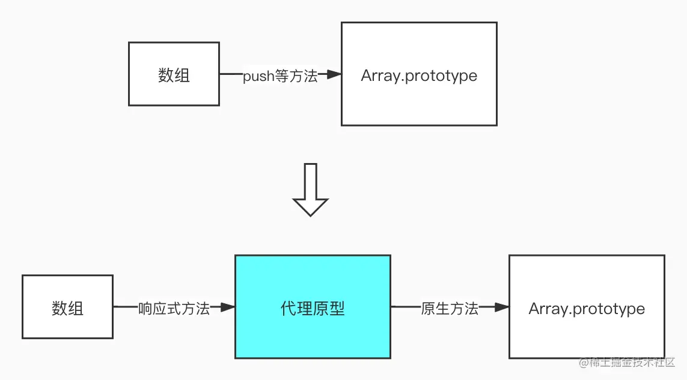

### 为什么要对数组特殊处理

上一篇文章讲到了 vue 数据响应式的基本原理，结尾提到，我们要对数组进行一个单独的处理。很多人可能会有疑问了，为什么要对数组做特殊处理呢？数组不就是 key 为数值的对象吗？那我们不妨来尝试一下

```js
function defineReactive(obj, key, val) {
  Object.defineProperty(obj, key, {
    get() {
      console.log('get: ', val)
      return val
    },
    set(newVal) {
      console.log('set: ', newVal)
      newVal = val
    }
  })
}

const arr = [1, 2, 3]
arr.forEach((val, index, arr) => {
  defineReactive(arr, index, val)
})
```

如果我们访问和获取 arr 的值，getter 和 setter 也会被触发，这不是可以吗？但是如果 arr.unshift(0) 呢？数组的每个元素要依次向后移动一位，这就会触发 getter 和 setter，导致依赖发生变化。由于数组是顺序结构，所以索引 (key) 和值不是绑定的，因此这种护理方法是有问题的。
那既然不能监听数组的索引，那就监听数组本身吧。vue 对 js 中 7 种会改变数组的方法进行了重写：push, pop, unshift, shift, splice, reverse, sort。那么，我们就要对 Observer 进行修改了：

```js
class Observer {
  constructor(value) {
    this.value = value
    if (Array.isArray(value)) {
      // 代理原型。..
      this.observeArray(value)
    } else {
      this.walk(value)
    }
  }

  walk(obj) {
    Object.keys(obj).forEach((key) => defineReactive(obj, key, obj[key]))
  }
  // 需要继续监听数组内的元素（如果数组元素是对象的话）
  observeArray(arr) {
    arr.forEach((i) => observe(i))
  }
}
```

关键的处理就是代理原型

### 代理原型

相信大家对原型链都比较熟悉了，当我们调用 arr.push() 时，实际上是调用了 Array.prototype.push，我们想对 push 方法进行特殊处理，除了重写该方法，还有一种手段，就是设置一个代理原型


我们在数组实例和 Array.prototype 之间增加了一层代理来实现派发更新（依赖收集部分后面单独讲），数组调用代理原型的方法来派发更新，代理原型再调用真实原型的方法实现原有的功能：

```js
// Observer.js
if (Array.isArray(value)) {
  Object.setPrototypeOf(value, proxyPrototype) // value.__proto__ === proxyPrototype
  this.observeArray(value)
}

// array.js
const arrayPrototype = Array.prototype // 缓存真实原型

// 需要处理的方法
const reactiveMethods = [
  'push',
  'pop',
  'unshift',
  'shift',
  'splice',
  'reverse',
  'sort'
]

// 增加代理原型 proxyPrototype.__proto__ === arrayProrotype
const proxyPrototype = Object.create(arrayPrototype)

// 定义响应式方法
reactiveMethods.forEach((method) => {
  const originalMethod = arrayPrototype[method]
  // 在代理原型上定义变异响应式方法
  Object.defineProperty(proxyPrototype, method, {
    value: function reactiveMethod(...args) {
      const result = originalMethod.apply(this, args) // 执行默认原型的方法
      // ... 派发更新。..
      return result
    },
    enumerable: false,
    writable: true,
    configurable: true
  })
})
```

问题来了，我们如何派发更新呢？对于对象，我们使用 dep.nofity 来派发更新，之所以能够拿到 dep 数组，是因为我们利用 getter 和 setter 形成了闭包，保存了 dep 数组，并且这样能够保证每个属性都有属于自己的 dep。那数组呢？如果再 array.js 中定义一个 dep，那所有的数组都会共享这一个 dep，显然是不行的，因此，vue 在每个对象身上添加了一个自定义属性：__ob__，这个属性保存自己的 Observer 实例，然后再 Observer 上添加一个属性 dep 不就可以了吗！

### __ob__属性

对 observe 做一个修改：

```js
// observe.js
function observe(value) {
  if (typeof value !== 'object') return
  let ob
  // __ob__还可以用来标识当前对象是否被监听过
  if (value.__ob__ && value.__ob__ instanceof Observer) {
    ob = value.__ob__
  } else {
    ob = new Observer(value)
  }
  return ob
}
```

Observer 也要做修改：

```js
constructor(value) {
  this.value = value
  this.dep = new Dep()
  // 在每个对象身上定义一个__ob__属性，指向每个对象的 Observer 实例
  def(value, '__ob__', this)
  if (Array.isArray(value)) {
    Object.setPrototypeOf(value, proxyPrototype)
    this.observeArray(value)
  } else {
    this.walk(value)
  }
}

// 工具函数 def，就是对 Object.defineProperty 的封装
function def(obj, key, value, enumerable = false) {
  Object.defineProperty(obj, key, {
    value,
    enumerable,
    writable: true,
    configurable: true
  })
}

```

这样，对象 obj: { arr: [...] }就会变为 obj: { arr: [..., __ob__: {} ], __ob__: {} }

```js
// array.js
reactiveMethods.forEach((method) => {
  const originalMethod = arrayPrototype[method]
  Object.defineProperty(proxyPrototype, method, {
    value: function reactiveMethod(...args) {
      const result = originalMethod.apply(this, args)
      const ob = this.__ob__ // 新增
      ob.dep.notify()        // 新增
      return result
    },
    enumerable: false,
    writable: true,
    configurable: true
  })
})
```

还有一个小细节，push, unshift, splice 可能会向数组中增加元素，这些增加的元素也应该被监听：

```js
Object.defineProperty(proxyPrototype, method, {
  value: function reactiveMethod(...args) {
    const result = originalMethod.apply(this, args)
    const ob = this.__ob__
    // 对 push，unshift，splice 的特殊处理
    let inserted = null
    switch (method) {
      case 'push':
      case 'unshift':
        inserted = args
        break
      case 'splice':
        // splice 方法的第三个及以后的参数是新增的元素
        inserted = args.slice(2)
    }
    // 如果有新增元素，继续对齐进行监听
    if (inserted) ob.observeArray(inserted)
    ob.dep.notify()
    return result
  },
  enumerable: false,
  writable: true,
  configurable: true
})
```

到这里，我们通过在对象身上新增一个__ob__属性，完成了数组的派发更新，接下来是依赖收集

### 依赖收集

在将依赖收集之前，我们先看一下__ob__这个属性

```js
const obj = {
  arr: [
    {
      a: 1
    }
  ]
}
```

执行 observe(obj) 后，obj 变成了下面的样子

```js
obj: {
  arr: [
    {
      a: 1,
      __ob__: {...} // 增加
    },
    __ob__: {...}   // 增加
  ],
  __ob__: {...}     // 增加
}
```

我们的 defineReactive 函数中，为了递归地为数据设置响应式，调用了 observe(val)，而现在的 observe() 会返回 ob，也就是 value.__ob__，那我们不妨接收一下这个返回值

```js
// defineReactive.js
let childOb = observe(val) // 修改

set: function reactiveSetter(newVal) {
  if (val === newVal) {
    return
  }
  val = newVal
  childOb = observe(newVal) // 修改
  dep.notify()
}
```

那这个 childOb 是什么呢？比如看 obj.arr 吧：

执行 observe(obj) 会触发 new Observer(obj)，设置了 obj.__ob__属性，接下来遍历 obj 的属性，执行 defineReactive(obj, arr, obj.arr)
执行 defineReactive(obj, arr, obj.arr) 时，会执行 observe(obj.arr)，返回值就是 obj.arr.__ob__

也就是说，每个属性（比如 arr 属性）的 getter 和 setter 不仅通过闭包保存了属于自己的 dep，而且通过__ob__保存了自己的 Observer 实例，Observer 实例上又有一个 dep 属性。如果添加以下代码：

```js
// defineReactive.js
get: function reactiveGetter() {
  if (Dep.target) {
    dep.depend()
    childOb.dep.depend() // 新增
  }
  return val
}
```

就会有下面的情况：每个属性的 getter 和 setter 通过闭包保存了 dep，这个 dep 收集了依赖自己的 watcher， 闭包中还保存了 chilOb，childOb.dep 也保存了依赖自己的 watcher，这两个属性保存的 watcher 相同，那前文讲到的派发更新就能够实现了。

obj.prop 闭包中保存的 childOb 就是 obj.prop.__ob__，闭包中的 dep 与 childOb.dep 保存的内容相同

但是dep和childOb.dep保存的watcher并不完全相同，看obj[arr](0).a，由于这是一个基本类型，对它调用observe会直接返回，因此所以没有__ob__属性，但是这个属性闭包中的dep能够收集到依赖自己的watcher。所以上述代码可能会报错，故做如下修改

```js
get: function reactiveGetter() {
  if (Dep.target) {
    dep.depend()
    if (childOb) {
      childOb.dep.depend() // 新增
    }
  }
  return val
}
```

### 依赖数组就等于依赖了数组中所有的元素

看这个例子：

```js
const obj = {
  arr: [
    { a: 1 }
  ]
}

observe(obj)

// 数据监听后的 obj
obj: {
  arr: [
    {
      a: 1,
      __ob__: {...}
    },
    __ob__: {...}
  ],
  __ob__: {...}
}
```

新建一个依赖 arr 的 watcher，如果为 obj.arr[0] 增加一个属性：

```js
Vue.set(obj.arr[0], 'b', 2) // 注意是 Vue.set
```

这样是不会触发 watcher 回调函数的。因为我们的 watcher 依赖 arr，求值时触发了 obj.arr 的 getter，所以 childOb.dep(arr.__ob__.dep) 中收集到了 watcher。但是 obj.arr[0].__ob__中并没有收集到 watcher，所以为其设置新值不会触发更新。但是 Vue 认为，只要依赖了数组，就等价于依赖了数组中的所有元素，因此，我们需要进一步处理

```js
// defineReactive.js
get: function reactiveGetter() {
  if (Dep.target) {
    dep.depend()
    if (childOb) {
      childOb.dep.depend()
      // 新增
      if (Array.isArray(val)) {
        dependArray(val)
      }
    }
  }
  return val
}

function dependArray(array) {
  for (let e of array) {
    e && e.__ob__ && e.__ob__.dep.depend()
    if (Array.isArray(e)) {
      dependArray(e)
    }
  }
}
```

以上新增代码的作用，就是当依赖是数组时，遍历这个数组，为每个元素的__ob__.dep 中添加 watcher。

### 总结

我们通过设置代理原型，让数组执行变异方法来完成响应式，并且为每个属性设置了__ob__属性，这样，我们在闭包之外就能访问 dep 了，从而完成派发更新，包括 Vue.set 方法也利用了这个属性。
其实对于数组来说，依赖收集阶段依然是在 getter 中完成的，只不过是借助了 arr.__ob__来完成，并且需要对数组的所有项都添加依赖，而更新派发是在变异方法中完成的，依然借助了__ob__。
