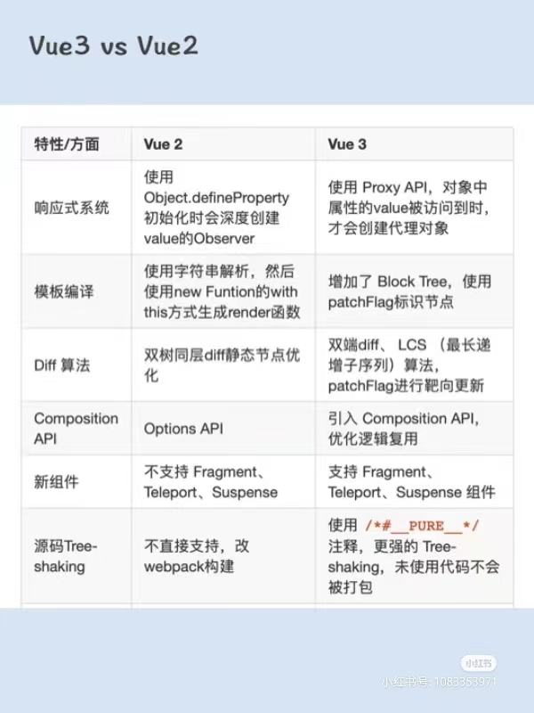
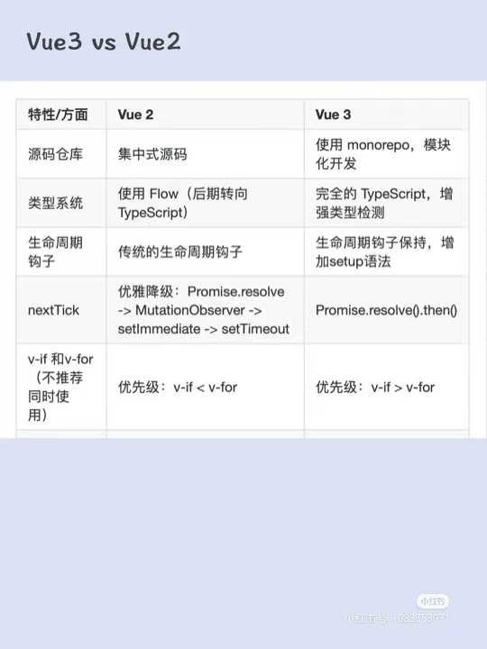

- **体积优化**: vue3 的源码采用 `Monorepo` 架构并且基于`ES Module`模块化规范，实现了从模块管理到包管理的转变，使得能够支持 `tree-shaking`，不使用就不会被打包 *vue2 的方法都放在实例对象上，而 vue3 中都是函数形式*

- **数据劫持优化**: vue2 的数据劫持是通过 `defineProperty` ，vue3 中使用 `Proxy` 实现数据劫持，Proxy 是额外使用一个代理对象解决了新增删除和数组索引无法被高性能的监听的问题。
而且 Vue3 是在真正访问到的内部属性才会触发`proxy代理对象`的`get`方法，才会去收集依赖而不是无脑递归所有属性创建`get,set`, 并且如果发现属性是引用类型会递归调用`reactive`处理。提高了性能

- **编译优化**: vue3 对`模板编译和diff 算法`进行了优化，编译时生成 Block tree 可以收集静态节点，减少比较，提高渲染的性能

- vue2 采用的是 Flow 来做静态类型检测，而 vue3 使用 typescript 重构代码，增强类型检测。

- vue3 采用 compositionApi 进行组织功能，优化复用逻辑，相较于 optionApi 类型推断更加便捷

- 增加了 Fragment,Teleport，Suspense 组件
1. Fragment 组件：Fragment 组件是 Vue3 中的一个新特性，它允许你在模板中使用多个根节点，而不需要像 Vue2 中一样使用一个外层元素包裹。在 Vue3 中，你可以使用`<template>`标签或者`<Fragment>`组件来实现多个根节点。

2. Teleport 组件：Teleport 组件是 Vue3 中的一个新组件，它提供了一种将组件的内容渲染到 DOM 中的不同位置的方式。使用 Teleport 组件，你可以将组件的内容渲染到 DOM 中的任何位置，而不需要将组件放在目标位置的上层组件中。
**Vue3 Teleport 组件原理分析 https://juejin.cn/post/7038923611935571981**

3. Suspense 组件：Suspense 组件是 Vue3 中的一个新组件，它提供了一种优雅的方式来处理异步组件的加载和错误。使用 Suspense 组件，你可以在异步组件加载完成之前显示一个占位符，并在加载过程中处理错误。

